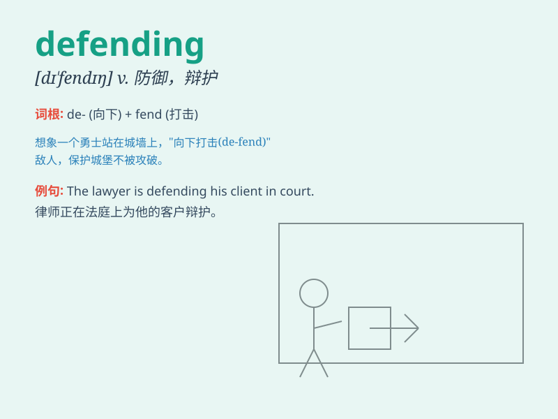

## defending

**英音:** _[dɪˈfendɪŋ]_ **美音:** _[dɪˈfendɪŋ]_

**译义:** *v. 防御；辩护；保卫（defend 的现在分词）*

### 短语

+ **defending champion:** _卫冕冠军_

+ **defending team:** _防守队_

+ **defending wall:** _防御墙_

+ **defending position:** _防守位置_

+ **defending argument:** _辩护论点_

### 例句

#### 例句1

> **The defending champion was determined to retain the title.**

**中文翻译:** 这位卫冕冠军决心保住头衔。

**单词释义:** 防守的；卫冕的

#### 例句2

> **The defending team put up a strong resistance.**

**中文翻译:** 防守的队伍进行了顽强的抵抗。

**单词释义:** 防守的

#### 例句3

> **He played a key role in the defending of the city.**

**中文翻译:** 他在城市的防卫中发挥了关键作用。

**单词释义:** 防御；保卫

### 背诵小故事

> In a fierce battle, the brave soldiers were constantly defending
their territory. They stood firm, facing the enemy\'s attacks without
fear. The act of defending was their mission and responsibility.

**在一场激烈的战斗中，勇敢的士兵们一直在保卫他们的领土。他们坚定不移，无惧敌人的攻击。保卫这个行为就是他们的使命和责任。**

### 图义

