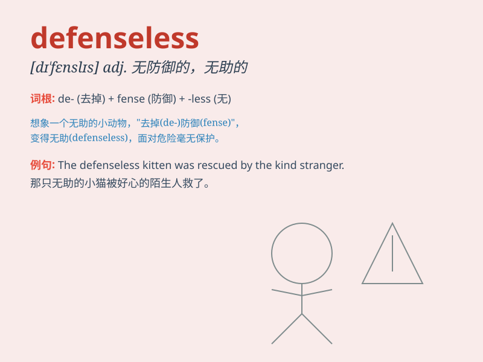

## defenseless

**英音:** _[dɪ\'fensləs]_ **美音:** _[dɪ\'fensləs]_

**译义:** *adj.无防备的*

### 短语

+ **defenseless victim:** _无防备的受害者_

+ **defenseless city:** _无防御的城市_

+ **defenseless child:** _无自卫能力的孩子_

+ **defenseless state:** _无防御状态_

+ **remain defenseless:** _保持无防备_

### 例句

#### 例句1

> **The small village was left defenseless against the invading
army.**

**中文翻译:** 这个小村庄在入侵军队面前毫无防御能力。

**单词释义:** 无防御的；不能自卫的

#### 例句2

> **The defenseless child was an easy target for the bullies.**

**中文翻译:** 手无寸铁的孩子很容易成为恶霸的目标。

**单词释义:** 无防备的；无保护的

#### 例句3

> **The animals in the zoo are kept defenseless to ensure the safety
of visitors.**

**中文翻译:**
动物园里的动物都处于毫无防御能力的状态，以确保游客的安全。

**单词释义:** 无抵御能力的

### 背诵小故事

> A small village was attacked by bandits. The villagers were
defenseless as they had no weapons or guards to protect themselves. They
could only watch helplessly as their homes were looted.

**一个小村庄遭到了强盗的袭击。村民们毫无防备，因为他们既没有武器也没有守卫来保护自己。他们只能眼睁睁地看着自己的家园被洗劫一空。**

### 图义

