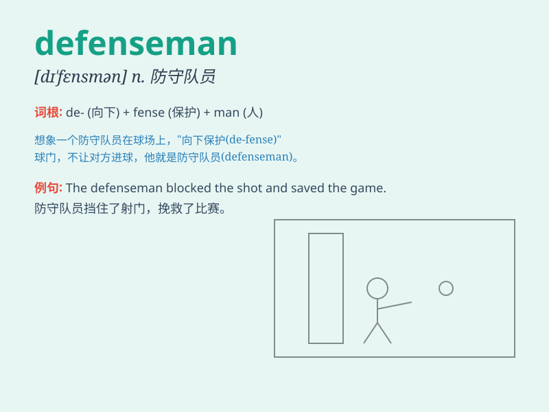

## defenseman

**英音:** _[dɪˈfɛnsmən]_ **美音:** _[dɪˈfɛnsmən]_

**译义:** *n.防守队员（尤指冰球或足球中的）*

### 短语

+ **star defenseman:** _明星防守队员_

+ **experienced defenseman:** _经验丰富的防守队员_

+ **young defenseman:** _年轻的防守队员_

+ **veteran defenseman:** _资深防守队员_

+ **top defenseman:** _顶级防守队员_

### 例句

#### 例句1

> **The defenseman blocked the opponent\'s shot with his stick.**

**中文翻译:** 这名防守队员用他的球棍挡住了对手的射门。

**单词释义:** 防守队员

#### 例句2

> **The star defenseman made a crucial tackle in the final minutes of
the game.**

**中文翻译:** 这位明星防守队员在比赛的最后几分钟做出了关键的铲球。

**单词释义:** 防守队员

#### 例句3

> **The team\'s success relied heavily on the performance of their
defenseman.**

**中文翻译:** 球队的成功在很大程度上依赖于他们防守队员的表现。

**单词释义:** 防守队员

### 背诵小故事

> In a fierce hockey game, the team was in trouble. But the defenseman
was like a brave warrior. He blocked the opponent\'s attacks again and
again, protecting the goal. Remember, a \'defenseman\' is one who
defends in sports!

**在一场激烈的曲棍球比赛中，球队陷入困境。但防守队员就像勇敢的战士。他一次又一次地阻挡对手的进攻，守护球门。记住，\'defenseman\'就是体育比赛中的防守队员！**

### 图义

