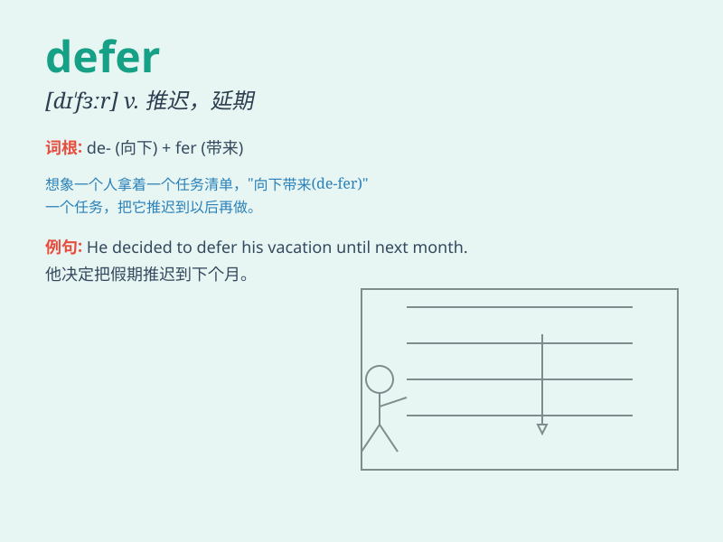

## defer

**英音:** _[dɪ\'fɜː]_ **美音:** _[dɪ\'fɝ]_

**译义:** *vi.推迟,延期,听从,服从vt.使推迟,使延期*

### 短语

+ **defer to:** _尊重；听从；服从_

+ **defer payment:** _延期付款_

+ **defer decision:** _推迟决定_

+ **defer indefinitely:** _无限期推迟_

+ **defer gratification:** _延迟满足_

### 例句

#### 例句1

> **The meeting has been deferred until next week.**

**中文翻译:** 会议已推迟到下周。

**单词释义:** 推迟；延期

#### 例句2

> **He chose to defer his studies for a year.**

**中文翻译:** 他选择推迟一年学业。

**单词释义:** 推迟；延缓

#### 例句3

> **We should not defer making a decision any longer.**

**中文翻译:** 我们不应该再推迟做出决定。

**单词释义:** 推迟；拖延

### 背诵小故事

> A student always wanted to defer doing his homework. He thought he
could do it later, but ended up in a rush. \'Defer\' means to put off or
delay something to a later time.

**一个学生总是想推迟做他的作业。他觉得可以晚点做，但最后却很匆忙。'defer'意思是把某事推迟或延迟到稍后的时间。**

### 图义

