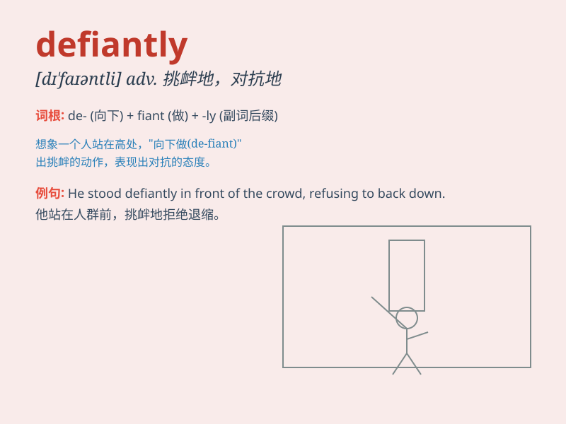

## defiantly

**英音:** _[dɪ\'faɪəntli]_ **美音:** _[dɪ\'faɪəntli]_

**译义:** *adv.挑战地,对抗地*

### 短语

+ **defiantly refuse:** _挑衅地拒绝_

+ **defiantly oppose:** _公然反对_

+ **defiantly stand:** _挑衅地站立_

+ **defiantly declare:** _挑衅地宣称_

+ **defiantly challenge:** _公然挑战_

### 例句

#### 例句1

> **He defiantly refused to obey the rules.**

**中文翻译:** 他公然拒绝遵守规则。

**单词释义:** 挑衅地；违抗地

#### 例句2

> **She stared defiantly at her critics.**

**中文翻译:** 她挑衅地盯着批评她的人。

**单词释义:** 挑衅地；蔑视地

#### 例句3

> **The boy defiantly walked away from his parents\' scolding.**

**中文翻译:** 男孩在父母的责骂下毅然走开。

**单词释义:** 违抗地；对抗地

### 背诵小故事

> A naughty boy was caught stealing candy. When asked why he did it, he
defiantly raised his head and said, \'I just wanted to!\' Here,
\'defiantly\' shows the boy\'s bold and disobedient attitude.

**一个顽皮的男孩偷糖果被抓住了。当被问到为什么这么做时，他挑衅地抬起头说：'我就是想！'
这里，'defiantly'展现了男孩大胆且不服的态度。**

### 图义

