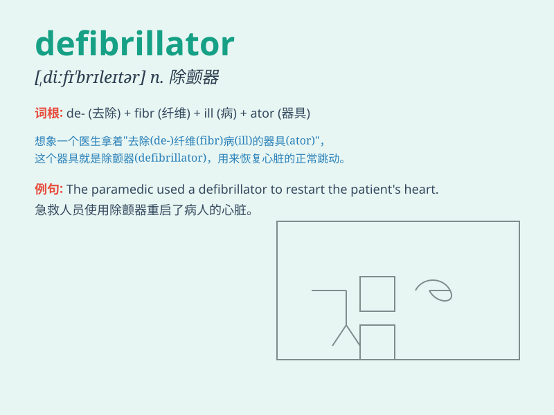

## defibrillator

**英音:** _[diːˈfɪbrɪleɪtə(r)]_ **美音:**
_[diːˈfɪbrɪleɪtər]_

**译义:** *n.[医](电击)去纤颤器*

### 短语

+ **external defibrillator:** _体外除颤器_

+ **automated external defibrillator:** _自动体外除颤器_

+ **manual defibrillator:** _手动除颤器_

+ **portable defibrillator:** _便携式除颤器_

+ **implantable defibrillator:** _植入式除颤器_

### 例句

#### 例句1

> **The hospital has just purchased a new defibrillator.**

**中文翻译:** 医院刚刚购买了一台新的除颤器。

**单词释义:** 除颤器

#### 例句2

> **The paramedic quickly brought the defibrillator to the patient\'s
side.**

**中文翻译:** 护理人员迅速将除颤器带到患者身边。

**单词释义:** 除颤器

#### 例句3

> **The defibrillator is a crucial piece of equipment in emergency
medical situations.**

**中文翻译:** 除颤器是紧急医疗情况下的重要设备。

**单词释义:** 除颤器

### 背诵小故事

> A patient\'s heart stopped. The doctor rushed in with a
defibrillator. It sent an electric shock to restart the heart. Everyone
held their breath. Luckily, the defibrillator worked and saved the
patient\'s life.

**一位病人的心脏停止了跳动。医生拿着除颤器冲了进来。它发出电击来重新启动心脏。每个人都屏住了呼吸。幸运的是，除颤器起作用了，挽救了病人的生命。**

### 图义

