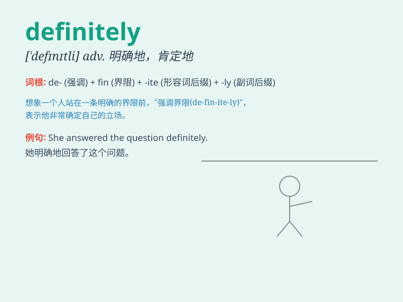

## definitely

**英音:** _[\'defɪnɪtlɪ]_ **美音:** _[\'dɛfɪnətli]_

**译义:** *adv.明确地,干脆地*

### 短语

+ **definitely not:** _绝对不；肯定不_

+ **definitely yes:** _绝对是；肯定是_

+ **most definitely:** _非常肯定；绝对地_

+ **definitely better:** _肯定更好_

+ **definitely true:** _绝对真实；肯定正确_

### 例句

#### 例句1

> **I will definitely come to your party.**

**中文翻译:** 我一定会来参加你们的聚会。

**单词释义:** 肯定；一定

#### 例句2

> **She is definitely the best candidate for the job.**

**中文翻译:** 她绝对是这份工作的最佳人选。

**单词释义:** 绝对；毫无疑问

#### 例句3

> **This is definitely a problem that needs to be solved.**

**中文翻译:** 这绝对是一个需要解决的问题。

**单词释义:** 肯定；确实

### 背诵小故事

> A brave explorer was lost in a cave. When asked if he would find the
exit, he said \'Definitely!\' with confidence. It means without doubt or
surely. So, remember the explorer\'s certainty when you think of
\'definitely\'.

**一位勇敢的探险家在洞穴中迷路了。当被问到他是否能找到出口时，他自信地说'Definitely！'
这个词的意思是毫无疑问地、肯定地。所以，当你想到'definitely'时，就记住这位探险家的笃定。**

### 图义

