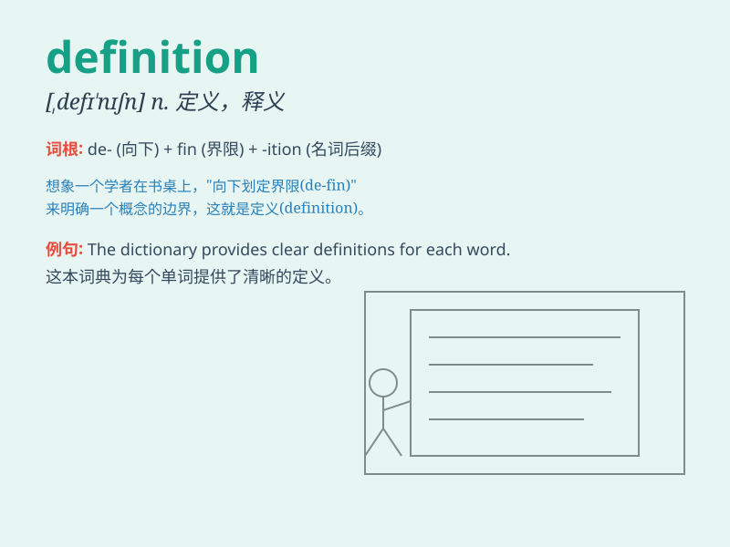

## definition

**英音:** _[defɪ\'nɪʃ(ə)n]_ **美音:** _[,dɛfɪ\'nɪʃən]_

**译义:** *n.定义,解说,精确度,(轮廓影像等的)清晰度*

### 短语

+ **clear definition:** _清晰的定义_

+ **precise definition:** _精确的定义_

+ **broad definition:** _宽泛的定义_

+ **legal definition:** _法律定义_

+ **working definition:** _工作定义；暂定定义_

### 例句

#### 例句1

> **The definition of \'love\' varies from person to person.**

**中文翻译:** "爱"的定义因人而异。

**单词释义:** 定义；释义

#### 例句2

> **Can you give a clear definition of this term?**

**中文翻译:** 你能给这个词一个明确的定义吗？

**单词释义:** 定义；释义

#### 例句3

> **The dictionary provides precise definitions of words.**

**中文翻译:** 该词典提供了单词的精确定义。

**单词释义:** 释义

### 背诵小故事

> A detective was trying to solve a mystery. The key was to find the
exact definition of each clue. Finally, with clear definitions, he
cracked the case.

**一位侦探正在努力侦破一个谜团。关键在于找出每条线索的确切定义。最终，凭借清晰的定义，他破获了此案。**

### 图义

