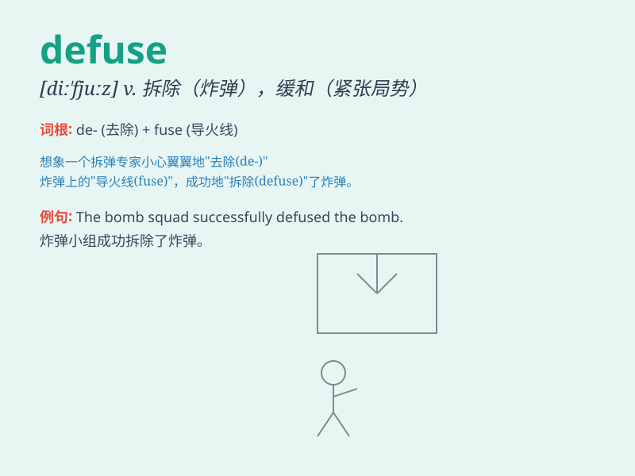

## defuse

**英音:** _[diː\'fjuːz]_ **美音:** _[,di\'fjuz]_

**译义:** *vt.去掉\...的雷管*

### 短语

+ **defuse a bomb:** _拆除炸弹_

+ **defuse a crisis:** _化解危机_

+ **defuse a situation:** _缓和局势_

+ **defuse an argument:** _消除争论_

+ **defuse tension:** _缓解紧张局势_

### 例句

#### 例句1

> **The bomb squad was called in to defuse the explosive device.**

**中文翻译:** 拆弹小组被召集来拆除爆炸装置。

**单词释义:** 拆除（炸弹等）的引信

#### 例句2

> **His calm words managed to defuse the tense situation.**

**中文翻译:** 他平静的话语缓解了紧张的气氛。

**单词释义:** 缓和，平息

#### 例句3

> **She tried to defuse the argument by changing the subject.**

**中文翻译:** 她试图通过改变话题来平息争论。

**单词释义:** 化解，消除

### 背诵小故事

> A terrorist placed a bomb in a crowded square. But a brave police
officer managed to defuse it by carefully cutting the wires. The people
were saved.

**一名恐怖分子在一个拥挤的广场放置了一枚炸弹。但是一位勇敢的警察通过小心地剪断导线成功拆除了炸弹。人们得救了。**

### 图义

