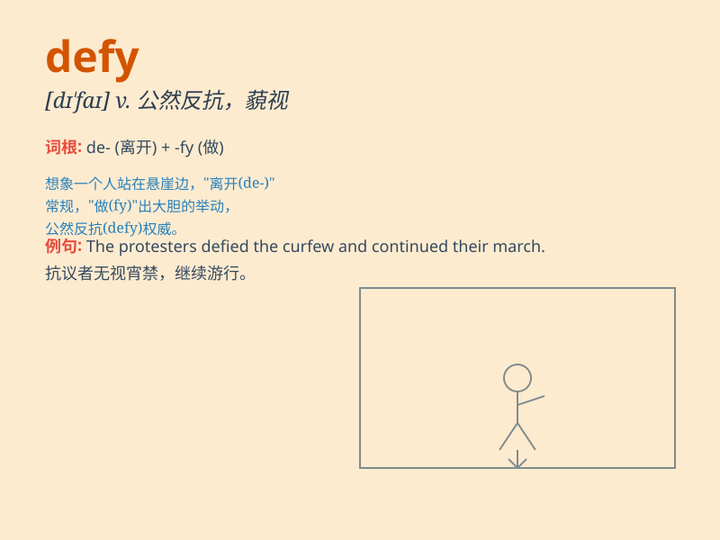

## defy

**英音:** _[dɪ\'faɪ]_ **美音:** _[\'difaɪ]_

**译义:** *vt.不服从,公然反抗,藐视,挑衅,违抗,使\...难于n.挑战*

### 短语

+ **defy authority:** _违抗权威_

+ **defy description:** _难以形容；无法描述_

+ **defy the law:** _违抗法律_

+ **defy convention:** _打破常规_

+ **defy explanation:** _难以解释_

### 例句

#### 例句1

> **He defied his parents and went to the party anyway.**

**中文翻译:** 他不顾父母的反对，还是去参加了聚会。

**单词释义:** 违抗；反抗

#### 例句2

> **The athlete defied the odds and won the championship.**

**中文翻译:** 这位运动员克服了困难，赢得了冠军。

**单词释义:** 对抗；挑战

#### 例句3

> **The ancient castle defies time and still stands strong.**

**中文翻译:** 这座古老的城堡经受住了岁月的考验，依然屹立不倒。

**单词释义:** 经受住；顶得住

### 背诵小故事

> A brave knight named Tom always defied the evil king\'s orders. He
refused to follow the unfair rules and fought for justice. His act of
defying showed great courage and determination.

**一位名叫汤姆的勇敢骑士总是违抗邪恶国王的命令。他拒绝遵循不公平的规则，并为正义而战。他的违抗行为展现了巨大的勇气和决心。**

### 图义

