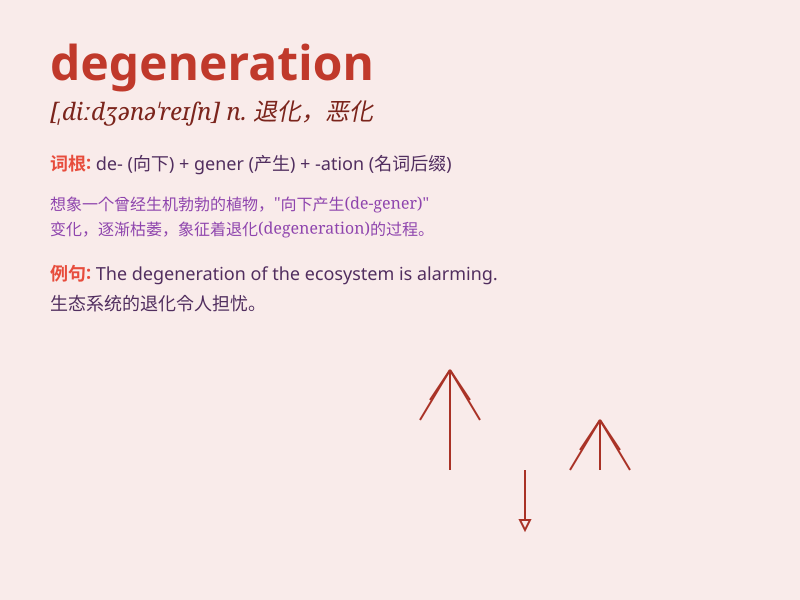

## degeneration

**英音:** _[dɪ,dʒenə\'reɪʃ(ə)n]_ **美音:**
_[dɪ,dʒɛnə\'reʃən]_

**译义:** *n.恶化*

### 短语

+ **cellular degeneration:** _细胞变性_

+ **nerve degeneration:** _神经变性_

+ **muscular degeneration:** _肌肉变性_

+ **joint degeneration:** _关节变性_

+ **retinal degeneration:** _视网膜变性_

### 例句

#### 例句1

> **The degeneration of his eyesight was caused by excessive use of
electronic devices.**

**中文翻译:** 他视力的退化是由于过度使用电子设备造成的。

**单词释义:** 退化；变坏；衰退

#### 例句2

> **The doctor was concerned about the degeneration of the patient\'s
joint.**

**中文翻译:** 医生对病人关节的退化感到担忧。

**单词释义:** （器官或组织的）变性；退化

#### 例句3

> **The degeneration of moral values in society is a worrying
trend.**

**中文翻译:** 社会道德价值观的退化是一个令人担忧的趋势。

**单词释义:** 堕落；衰退

### 背诵小故事

>
从前有个美丽的花园，人们精心呵护。但后来没人照顾，花草开始衰败（degeneration），失去了往日的生机。这就像degeneration这个词，意味着逐渐变坏、衰退。

**从前有个美丽的花园因无人照顾花草衰败的故事来辅助记忆degeneration这个表示逐渐变坏、衰退的单词**

### 图义

