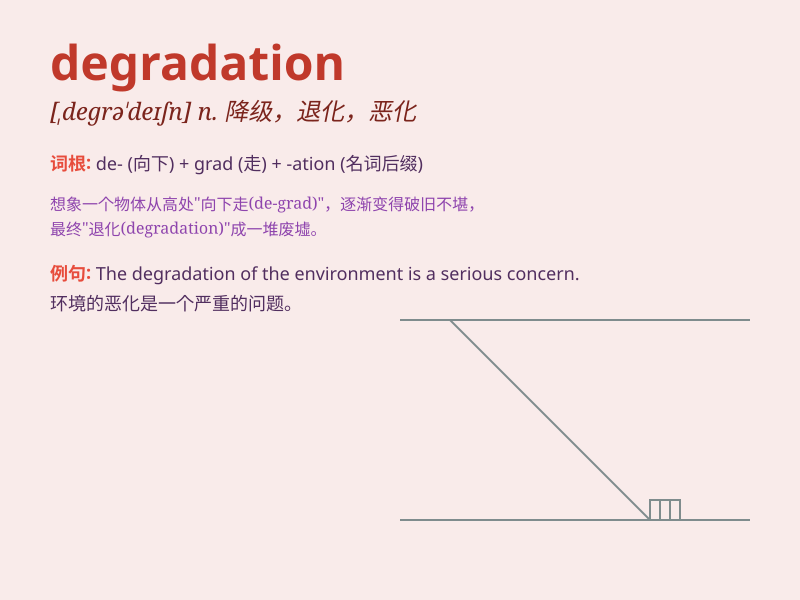

## degradation

**英音:** _[,degrə\'deɪʃ(ə)n]_ **美音:**
_[,dɛɡrə\'deʃən]_

**译义:** *n.降级,降格,退化*

### 短语

+ **environmental degradation:** _环境退化_

+ **soil degradation:** _土壤退化_

+ **degradation process:** _降解过程_

+ **moral degradation:** _道德败坏_

+ **degradation of quality:** _质量下降_

### 例句

#### 例句1

> **The degradation of the environment is a serious problem.**

**中文翻译:** 环境的退化是一个严重的问题。

**单词释义:** 退化；恶化

#### 例句2

> **The athlete suffered a degradation in performance due to
injury.**

**中文翻译:** 这位运动员因受伤而表现下降。

**单词释义:** 下降；降低

#### 例句3

> **The moral degradation of society concerns many people.**

**中文翻译:** 社会的道德堕落令许多人担忧。

**单词释义:** 堕落；败坏

### 背诵小故事

> A beautiful forest was once full of life. But due to human\'s
excessive logging and pollution, it suffered degradation. The trees
withered, and the animals lost their homes. Remember, \'degradation\'
means the process of becoming worse.

**一片美丽的森林曾经充满生机。但由于人类过度砍伐和污染，它遭受了退化。树木枯萎，动物失去了家园。记住，'degradation'意思是变坏的过程。**

### 图义

