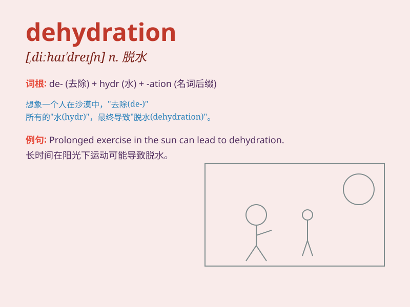

## dehydration

**英音:** _[,diːhaɪ\'dreɪʃən]_ **美音:**
_[,dihaɪ\'dreʃən]_

**译义:** *n.脱水*

### 短语

+ **dehydration syndrome:** _脱水综合征_

+ **heat dehydration:** _热脱水_

+ **severe dehydration:** _严重脱水_

+ **dehydration process:** _脱水过程_

+ **prevent dehydration:** _防止脱水_

### 例句

#### 例句1

> **The patient was suffering from severe dehydration.**

**中文翻译:** 这位病人正遭受着严重的脱水。

**单词释义:** 脱水

#### 例句2

> **Dehydration can cause fatigue and headaches.**

**中文翻译:** 脱水会导致疲劳和头痛。

**单词释义:** 脱水

#### 例句3

> **Proper hydration is important to prevent dehydration during
exercise.**

**中文翻译:** 在运动期间，适当补水对于预防脱水很重要。

**单词释义:** 脱水

### 背诵小故事

> A traveler was lost in the desert. He had no water and felt extremely
weak. This situation was called dehydration. His body was losing too
much water and he needed help urgently.

**一位旅行者在沙漠中迷路了。他没有水，感觉极度虚弱。这种情况被称为脱水。他的身体流失了太多水分，急需帮助。**

### 图义

