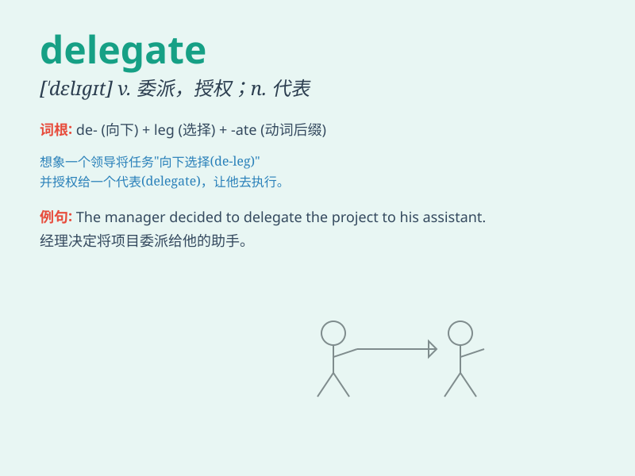

## delegate

**英音:** _[ˈdɛlɪˌɡeɪt; -ɡɪt; (for v.,) ˈdɛlɪˌɡeɪt]_
**美音:** _[ˈdɛləgɪt; (for v.,) ˈdɛləˌgeɪt]_

**译义:** *n.代表vt.委派\...为代表*

### 短语

+ **delegate authority:** _授予权力_

+ **delegate responsibility:** _委托责任_

+ **delegate task:** _委派任务_

+ **elected delegate:** _当选代表_

+ **conference delegate:** _会议代表_

### 例句

#### 例句1

> **The manager delegated the task to his assistant.**

**中文翻译:** 经理把任务委托给了他的助手。

**单词释义:** 委托；授权

#### 例句2

> **She was delegated to represent the company at the conference.**

**中文翻译:** 她被委派代表公司参加会议。

**单词释义:** 委派；选派

#### 例句3

> **The committee delegated the responsibility for making the
decision to a subcommittee.**

**中文翻译:** 委员会把做决定的责任委托给了一个小组委员会。

**单词释义:** 把（职责、责任等）委托（给）

### 背诵小故事

> A company needed someone to attend a meeting. They chose Tom as their
delegate. Tom went and represented the company well. \'Delegate\' means
a person chosen to represent others.

**一家公司需要有人去参加会议。他们选了汤姆作为他们的代表。汤姆去了并且很好地代表了公司。'delegate'意思是被挑选出来代表他人的人。**

### 图义

