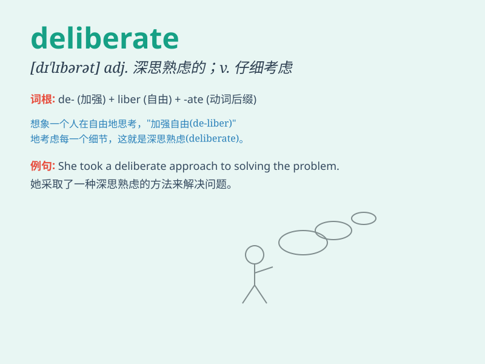

## deliberate

**英音:** _[dɪ\'lɪb(ə)rət]_ **美音:** _[dɪ\'lɪbərət]_

**译义:** *adj.深思熟虑的,故意的,预有准备的v.商讨*

### 短语

+ **deliberate act:** _故意的行为_

+ **deliberate decision:** _深思熟虑的决定_

+ **deliberate pace:** _从容的步伐_

+ **deliberate thought:** _审慎的思考_

+ **deliberate attempt:** _蓄意的尝试_

### 例句

#### 例句1

> **She made a deliberate choice to study medicine.**

**中文翻译:** 她经过深思熟虑后做出了学医的选择。

**单词释义:** 深思熟虑的

#### 例句2

> **The jury deliberated for several days before reaching a
verdict.**

**中文翻译:** 陪审团审议了好几天才做出裁决。

**单词释义:** 仔细考虑；商议

#### 例句3

> **It was a deliberate act of vandalism.**

**中文翻译:** 这是故意破坏的行为。

**单词释义:** 故意的

### 背诵小故事

> A detective was trying to solve a mystery. He needed to deliberate
carefully. He sat in a quiet room, thinking step by step, to make the
right decision. Finally, he found the key clue.

**一位侦探正在试图解开一个谜团。他需要仔细地思考。他坐在一个安静的房间里，一步一步地思考，以做出正确的决定。最后，他找到了关键线索。**

### 图义

