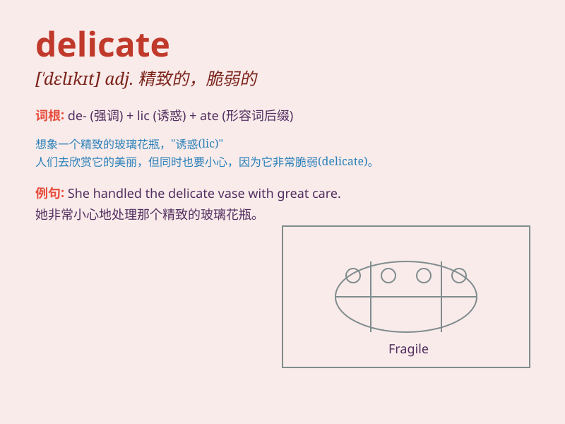

## delicate

**英音:** _[\'delɪkət]_ **美音:** _[ˈdɛlɪkɪt]_

**译义:**
*adj.精巧的,精致的,病弱的,脆弱的,微妙的,棘手的,灵敏的,精密的*

### 短语

+ **delicate balance:** _微妙的平衡_

+ **delicate situation:** _微妙的局势_

+ **delicate fabric:** _精致的织物_

+ **delicate flavor:** _细腻的味道_

+ **delicate health:** _脆弱的健康_

### 例句

#### 例句1

> **The delicate flower needs special care.**

**中文翻译:** 这朵娇弱的花需要特殊的照顾。

**单词释义:** 娇弱的

#### 例句2

> **She has a delicate constitution and often gets sick.**

**中文翻译:** 她体质虚弱，经常生病。

**单词释义:** 虚弱的

#### 例句3

> **The artist created a delicate sculpture.**

**中文翻译:** 这位艺术家创作了一件精美的雕塑。

**单词释义:** 精美的

### 背诵小故事

> A princess wore a delicate dress to the ball. But she had to be very
careful as it was easily torn. The dress was so fine and needed gentle
handling, just like the word \'delicate\' means fragile and needing
careful treatment.

**一位公主穿着一件精致的裙子去参加舞会。但她必须非常小心，因为它很容易被撕破。这条裙子如此精美，需要轻柔对待，就像'delicate'这个单词意味着脆弱的、需要小心处理的。**

### 图义

