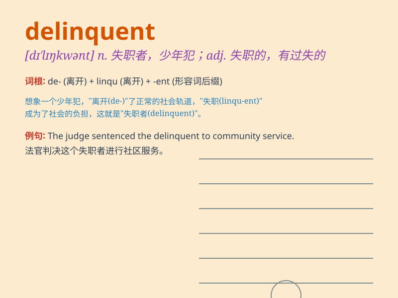

## delinquent

**英音:** _[dɪ\'lɪŋkw(ə)nt]_ **美音:** _[dɪ\'lɪŋkwənt]_

**译义:** *n.失职者,违法者adj.失职的,有过失的,违法的,拖欠债务的*

### 短语

+ **delinquent behavior:** _犯罪行为；违法行为_

+ **delinquent loan:** _拖欠贷款；逾期贷款_

+ **delinquent minor:** _犯罪未成年人；违法未成年人_

+ **delinquent account:** _拖欠账款；逾期账户_

+ **delinquent payment:** _逾期付款；拖欠款项_

### 例句

#### 例句1

> **The delinquent teenager was constantly getting into trouble with
the law.**

**中文翻译:** 这个违法的青少年总是陷入法律纠纷。

**单词释义:** 违法的；有过失的

#### 例句2

> **The company is pursuing delinquent accounts to recover the
outstanding debts.**

**中文翻译:** 公司正在追讨逾期未付的账目以收回欠款。

**单词释义:** 逾期未付的；拖欠的

#### 例句3

> **The delinquent behavior of the students caused concern among the
teachers.**

**中文翻译:** 学生们的不良行为引起了老师们的担忧。

**单词释义:** 不良的；有过错的

### 背诵小故事

> A young boy was often delinquent, skipping school and causing
trouble. One day, he realized his mistakes and decided to change. From
then on, he studied hard and became a good student. Remember, delinquent
means someone who behaves wrongly or breaks the law.

**一个小男孩经常行为不良，逃学并惹麻烦。有一天，他意识到自己的错误并决定改变。从此，他努力学习，成为了一名好学生。记住，delinquent
指的是行为不当或违法的人。**

### 图义

