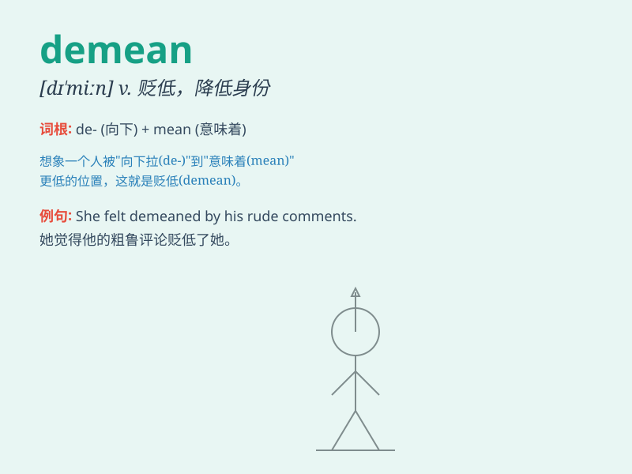

## demean

**英音:** _[dɪˈmiːn]_ **美音:** _[dɪˈmiːn]_

**译义:** *vt.举止,贬低身份*

### 短语

+ **demean oneself:** _降低身份；自贬_

+ **demean by:** _因\...而贬低_

+ **demean to:** _降低到\...程度_

+ **be demeaned:** _被贬低；被轻视_

+ **demean in character:** _在性格方面贬低_

### 例句

#### 例句1

> **Don\'t demean yourself by getting involved in such petty
affairs.**

**中文翻译:** 不要让自己卷入这种琐碎的事情而贬低自己。

**单词释义:** 贬低；降低身份

#### 例句2

> **His actions demeaned the entire team.**

**中文翻译:** 他的行为贬低了整个团队。

**单词释义:** 贬低；损害

#### 例句3

> **She felt demeaned when they made fun of her in public.**

**中文翻译:** 当他们在公共场合取笑她时，她感到被贬低了。

**单词释义:** 使丢脸；降低尊严

### 背诵小故事

> A young man always acted rudely and carelessly, which demeaned his
image in the eyes of others. People thought he had no good manners.
Later, he realized his mistake and changed.

**一个年轻人总是举止粗鲁、漫不经心，这贬低了他在别人眼中的形象。人们认为他没有良好的举止。后来，他意识到了自己的错误并做出了改变。**

### 图义

