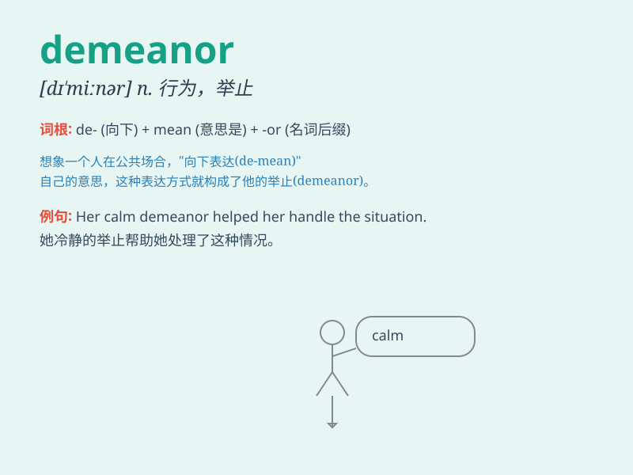

## demeanor

**英音:** _[dɪ\'miːnə]_ **美音:** _[dɪ\'miːnə]_

**译义:** *n.行为,风度*

### 短语

+ **good demeanor:** _良好的举止_

+ **bad demeanor:** _不良的举止_

+ **calm demeanor:** _平静的举止_

+ **polite demeanor:** _有礼貌的举止_

+ **arrogant demeanor:** _傲慢的举止_

### 例句

#### 例句1

> **His calm demeanor in the face of difficulty impressed
everyone.**

**中文翻译:** 他在困难面前沉着的举止给每个人都留下了深刻的印象。

**单词释义:** 举止；态度

#### 例句2

> **The suspect\'s nervous demeanor aroused the detective\'s
suspicion.**

**中文翻译:** 嫌疑人紧张的神态引起了侦探的怀疑。

**单词释义:** 神态

#### 例句3

> **Her friendly demeanor made her popular among her colleagues.**

**中文翻译:** 她友好的态度使她在同事中很受欢迎。

**单词释义:** 态度

### 背诵小故事

> A young artist was invited to a grand party. His calm and confident
demeanor made him stand out. He didn\'t panic but showed grace and
poise. People were impressed by his demeanor.

**一位年轻的艺术家被邀请参加一个盛大的聚会。他冷静且自信的举止使他脱颖而出。他没有惊慌，而是展现出优雅和沉着。人们对他的举止印象深刻。**

### 图义

