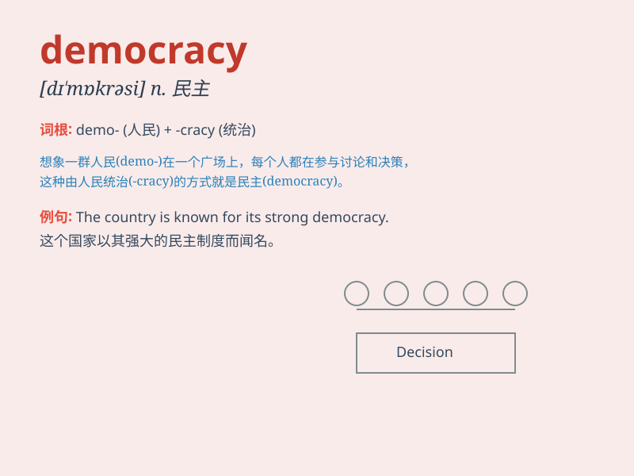

## democracy

**英音:** _[dɪ\'mɒkrəsɪ]_ **美音:** _[dɪˈmɑkrəsi]_

**译义:** *n.民主政治,民主主义*

### 短语

+ **liberal democracy:** _自由民主_

+ **representative democracy:** _代议制民主_

+ **direct democracy:** _直接民主_

+ **social democracy:** _社会民主_

+ **deliberative democracy:** _协商民主_

### 例句

#### 例句1

> **Democracy allows people to have a say in how they are
governed.**

**中文翻译:** 民主使人们能够对他们如何被治理发表意见。

**单词释义:** 民主；民主制度

#### 例句2

> **The country is striving to build a more perfect democracy.**

**中文翻译:** 这个国家正在努力建立一个更完善的民主制度。

**单词释义:** 民主政体；民主国家

#### 例句3

> **She is a strong advocate of democracy and human rights.**

**中文翻译:** 她是民主和人权的坚定拥护者。

**单词释义:** 民主；民主精神

### 背诵小故事

> In a distant land, people had the power to choose their leaders. They
spoke freely, shared ideas, and made decisions together. This was
democracy, where everyone\'s voice mattered.

**在一个遥远的地方，人们有权选择他们的领导人。他们自由发言，分享想法，并共同做决定。这就是民主，在这里每个人的声音都很重要。**

### 图义

