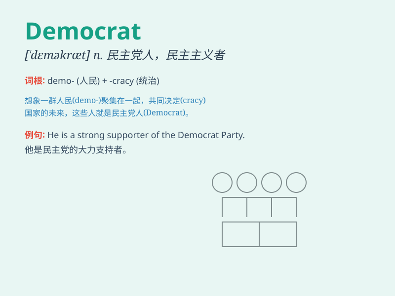

## Democrat

**英音:** _[ˈdeməkræt]_ **美音:** _[ˈdeməkræt]_

**译义:** *n. 民主党人；民主主义者；（美国）民主党党员*

### 短语

+ **Democratic Party:** _民主党_

+ **liberal Democrat:** _自由民主党人_

+ **Democrat senator:** _民主党参议员_

+ **conservative Democrat:** _保守派民主党人_

+ **progressive Democrat:** _进步派民主党人_

### 例句

#### 例句1

> **The Democrat won the local election by a narrow margin.**

**中文翻译:** 这位民主党人以微弱优势赢得了当地的选举。

**单词释义:** 民主党人

#### 例句2

> **He has always been a staunch Democrat.**

**中文翻译:** 他一直是坚定的民主党人。

**单词释义:** 民主党人

#### 例句3

> **The policies proposed by the Democrats aim to address social
inequality.**

**中文翻译:** 民主党人提出的政策旨在解决社会不平等问题。

**单词释义:** 民主党人

### 背诵小故事

>
想象一下，在一个小镇上，有一群人总是为了大家的公平和平等而努力。他们被称为\'Democrat\'，他们倡导民主，尊重每个人的权利，希望能让小镇变得更美好。

**想象在一个小镇上，有一群被称为"民主党人"的人，他们努力追求民主，倡导公平和平等，尊重每个人的权利，期望让小镇更美好。**

### 图义

