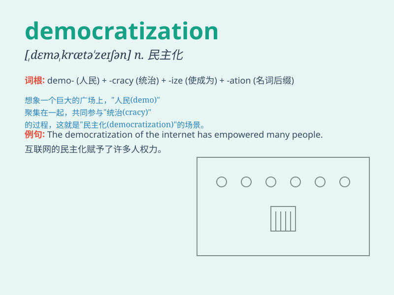

## democratization

**英音:** _[dɪ,mɒkrətaɪ\'zeɪʃən]_ **美音:**
_[dɪ,mɑkrətɪ\'zeʃən]_

**译义:** *n.民主化*

### 短语

+ **political democratization:** _政治民主化_

+ **economic democratization:** _经济民主化_

+ **process of democratization:** _民主化进程_

+ **accelerate democratization:** _加速民主化_

+ **democratization movement:** _民主化运动_

### 例句

#### 例句1

> **The process of democratization has brought significant changes to
the country.**

**中文翻译:** 民主化的进程给这个国家带来了重大的变化。

**单词释义:** 民主化

#### 例句2

> **We are committed to promoting democratization in all aspects of
society.**

**中文翻译:** 我们致力于在社会的各个方面推动民主化。

**单词释义:** 民主化

#### 例句3

> **The democratization of the political system is an ongoing
challenge.**

**中文翻译:** 政治制度的民主化是一个持续的挑战。

**单词释义:** 民主化

### 背诵小故事

> A small kingdom was ruled by a dictator. But the people fought hard
for change. Eventually, they achieved democratization. Everyone had a
say in how the country was run.

**一个小王国被独裁者统治着。但人民为了改变而努力斗争。最终，他们实现了民主化。每个人对国家如何管理都有发言权。**

### 图义

