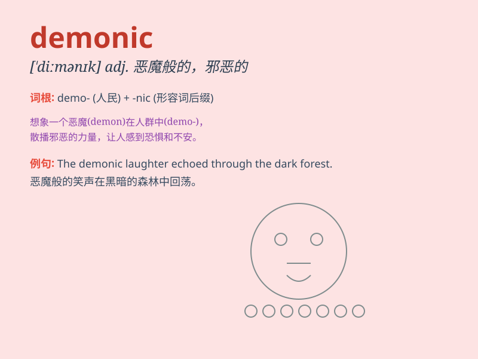

## demonic

**英音:** _[diˈmɒnɪk]_ **美音:** _[diˈmɑːnɪk]_

**译义:** *adj.恶魔的,有魔力的*

### 短语

+ **demonic possession:** _恶魔附身_

+ **demonic force:** _恶魔力量_

+ **demonic laughter:** _恶魔般的笑声_

+ **demonic influence:** _恶魔的影响_

+ **demonic entity:** _恶魔实体_

### 例句

#### 例句1

> **The demonic figure emerged from the shadows, terrifying all who
saw it.**

**中文翻译:** 这个恶魔般的身影从阴影中出现，吓坏了所有看到它的人。

**单词释义:** 恶魔般的；邪恶的

#### 例句2

> **She felt a demonic presence in the old house.**

**中文翻译:** 她在那所老房子里感觉到一种恶魔般的存在。

**单词释义:** 恶魔般的；魔鬼似的

#### 例句3

> **His demonic laughter echoed through the empty hall.**

**中文翻译:** 他恶魔般的笑声在空荡荡的大厅里回荡。

**单词释义:** 恶魔般的；邪恶的

### 背诵小故事

> A brave knight was on a quest. In a dark cave, he encountered a
demonic monster with red eyes and sharp teeth. The monster was very
powerful, but the knight finally defeated it with his courage and
skills.

**一位勇敢的骑士正在执行任务。在一个黑暗的洞穴里，他遇到了一只恶魔般的怪物，有着红色的眼睛和锋利的牙齿。这只怪物非常强大，但骑士最终凭借他的勇气和技能打败了它。**

### 图义

