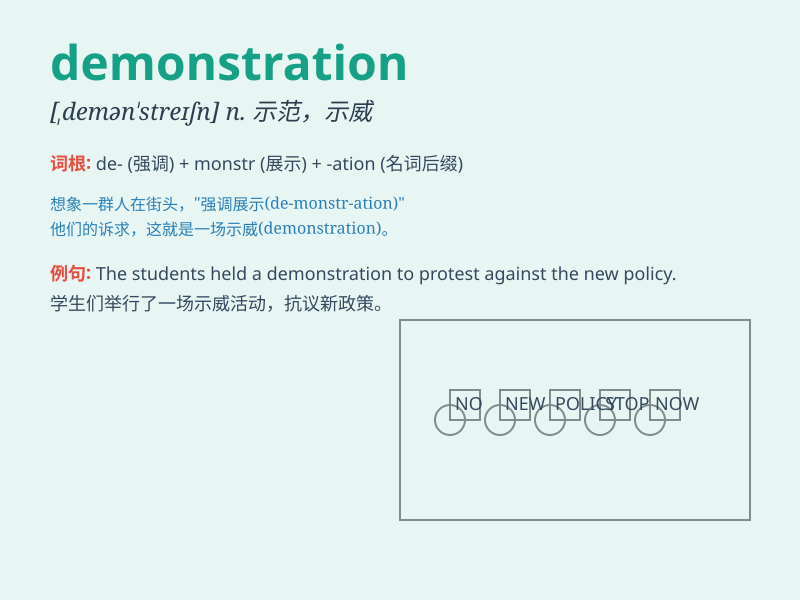

## demonstration

**英音:** _[demən\'streɪʃ(ə)n]_ **美音:**
_[,dɛmən\'streʃən]_

**译义:** *n.示范,实证*

### 短语

+ **public demonstration:** _公众示威_

+ **peaceful demonstration:** _和平示威_

+ **demonstration project:** _示范项目_

+ **demonstration effect:** _示范效应_

+ **make a demonstration:** _进行演示_

### 例句

#### 例句1

> **The workers held a demonstration against the new policy.**

**中文翻译:** 工人们举行了一场反对新政策的示威活动。

**单词释义:** 示威活动；游行示威

#### 例句2

> **The teacher gave a demonstration of how to solve the math
problem.**

**中文翻译:** 老师演示了如何解决这道数学题。

**单词释义:** 演示；示范

#### 例句3

> **This product requires a simple demonstration before use.**

**中文翻译:** 这个产品在使用前需要一个简单的展示。

**单词释义:** 展示；表明

### 背诵小故事

> A group of students held a demonstration in the square. They were
protesting against the new school rules. They shouted loudly and waved
banners to show their dissatisfaction. This was a powerful
demonstration.

**一群学生在广场举行了一场示威活动。他们抗议新的校规。他们大声呼喊并挥舞横幅来表明他们的不满。这是一场强有力的示威。**

### 图义

