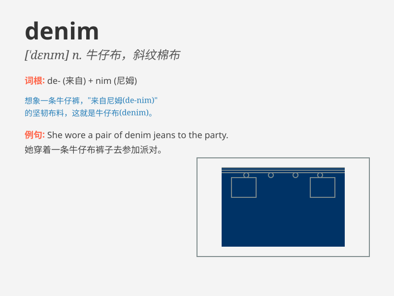

## denim

**英音:** _[\'denɪm]_ **美音:** _[\'dɛnɪm]_

**译义:** *n.粗斜纹棉布*

### 短语

+ **denim jacket:** _牛仔夹克_

+ **denim jeans:** _牛仔牛仔裤_

+ **denim skirt:** _牛仔裙_

+ **denim fabric:** _牛仔布_

+ **denim dress:** _牛仔连衣裙_

### 例句

#### 例句1

> **She wore a pair of denim jeans and a white T-shirt.**

**中文翻译:** 她穿着一条牛仔牛仔裤和一件白色 T 恤。

**单词释义:** 牛仔布；牛仔裤

#### 例句2

> **The denim jacket is very fashionable this year.**

**中文翻译:** 今年牛仔夹克非常时尚。

**单词释义:** 牛仔布；牛仔服

#### 例句3

> **He has a collection of denim shirts in his closet.**

**中文翻译:** 他的衣柜里有一系列牛仔衬衫。

**单词释义:** 牛仔布做的；牛仔服的

### 背诵小故事

>
想象一下，一个牛仔在沙漠中迷路了，又饿又渴。突然，他发现了一块神奇的布料，用它做了衣服，最终走出沙漠。这种神奇的布料就是\'denim\'（牛仔布），坚韧耐用，成为了牛仔的救星。

**想象一个牛仔在沙漠中因发现牛仔布而获救的故事来辅助记忆\'denim（牛仔布）\'这个单词**

### 图义

