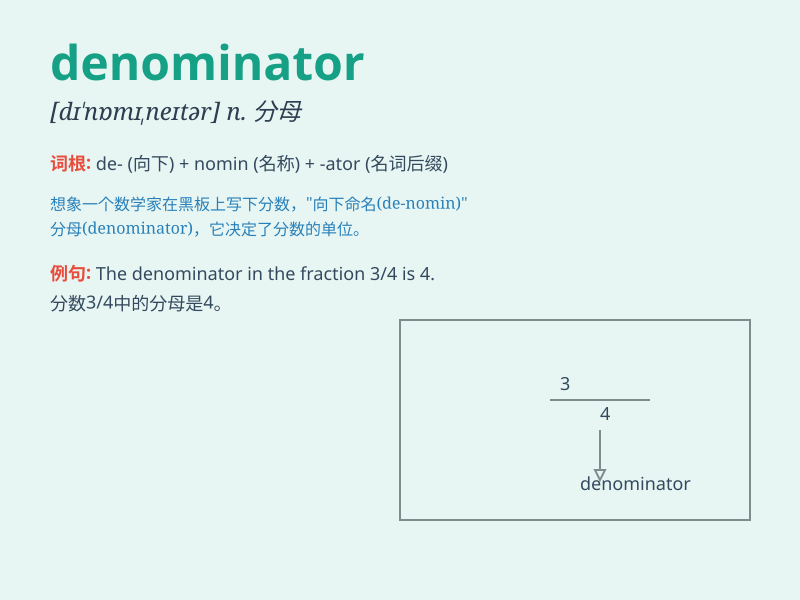

## denominator

**英音:** _[dɪ\'nɒmɪneɪtə]_ **美音:** _[dɪ\'nɑmə\'netɚ]_

**译义:** *n.[数] 分母,命名者*

### 短语

+ **common denominator:** _共同点；公分母_

+ **lowest common denominator:** _最小公分母_

+ **denominator of a fraction:** _分数的分母_

+ **principal denominator:** _主分母_

+ **dominant denominator:** _主导分母_

### 例句

#### 例句1

> **The denominator of the fraction 3/5 is 5.**

**中文翻译:** 分数 3/5 的分母是 5。

**单词释义:** 分母

#### 例句2

> **In this equation, the denominator determines the rate of
change.**

**中文翻译:** 在这个方程式中，分母决定了变化率。

**单词释义:** 分母

#### 例句3

> **The common denominator of these two fractions is 12.**

**中文翻译:** 这两个分数的公分母是 12。

**单词释义:** 公分母

### 背诵小故事

> A group of friends was dividing pizza. They needed to know the number
below the fraction line, the denominator, to share equally. It was like
finding the key to fair pizza slices!

**一群朋友在分披萨。他们需要知道分数线下的数字，即分母，才能平均分。这就像是找到公平分披萨片的关键！**

### 图义

