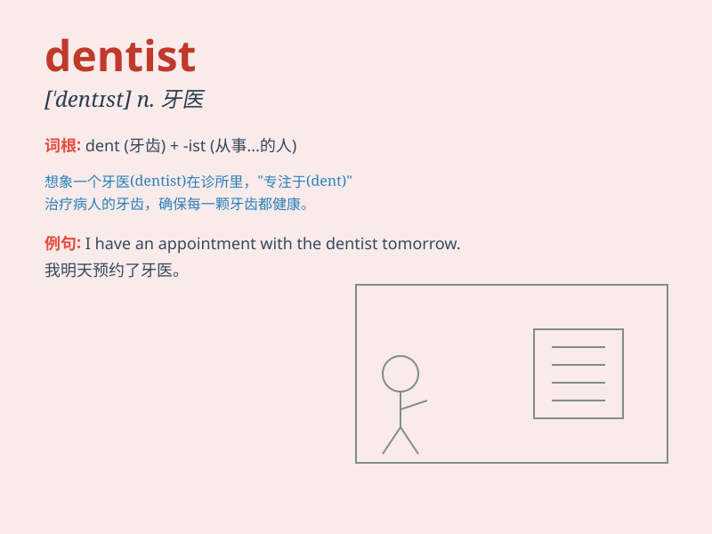

## dentist

**英音:** _[\'dentɪst]_ **美音:** _[\'dɛntɪst]_

**译义:** *n.牙科医生*

### 短语

+ **family dentist:** _家庭牙医_

+ **pediatric dentist:** _儿科牙医_

+ **cosmetic dentist:** _美容牙医_

+ **emergency dentist:** _急诊牙医_

+ **dental surgeon dentist:** _牙科外科医生_

### 例句

#### 例句1

> **I need to see a dentist because I have a toothache.**

**中文翻译:** 我需要去看牙医，因为我牙疼。

**单词释义:** 牙医

#### 例句2

> **The dentist examined my teeth carefully.**

**中文翻译:** 牙医仔细地检查了我的牙齿。

**单词释义:** 牙医

#### 例句3

> **My sister is training to become a dentist.**

**中文翻译:** 我妹妹正在接受培训，准备成为一名牙医。

**单词释义:** 牙医

### 背诵小故事

> One day, Tom had a terrible toothache. His mom took him to see a
person who could fix it - a dentist. The dentist was very kind and fixed
Tom\'s tooth quickly. Now Tom knows the dentist is the hero for teeth
problems.

**一天，汤姆牙疼得厉害。他妈妈带他去见一个能解决问题的人------牙医。牙医非常和蔼，很快就治好了汤姆的牙。现在汤姆知道牙医是解决牙齿问题的英雄。**

### 图义

