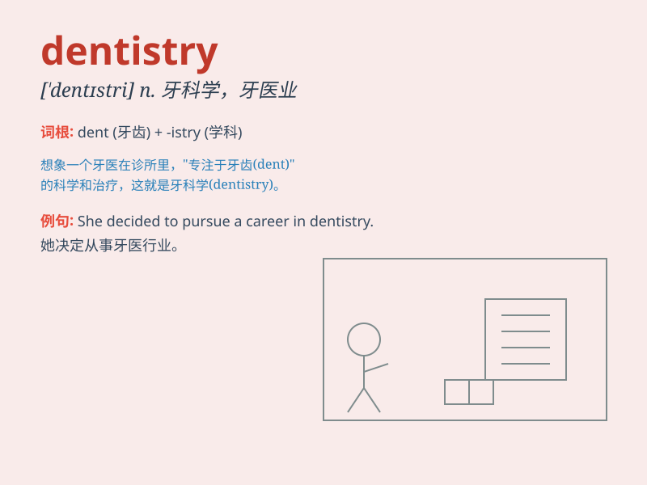

## dentistry

**英音:** _[\'dentɪstrɪ]_ **美音:** _[\'dɛntɪstri]_

**译义:** *n.牙科*

### 短语

+ **preventive dentistry:** _预防牙科_

+ **cosmetic dentistry:** _美容牙科_

+ **pediatric dentistry:** _儿童牙科_

+ **restorative dentistry:** _修复牙科_

+ **oral and maxillofacial dentistry:** _口腔颌面牙科_

### 例句

#### 例句1

> **I\'m considering studying dentistry at university.**

**中文翻译:** 我正在考虑在大学里学习牙科。

**单词释义:** 牙科；牙科学

#### 例句2

> **She has a great passion for dentistry and hopes to become a
renowned dentist.**

**中文翻译:** 她对牙科有着极大的热情，并希望成为一名著名的牙医。

**单词释义:** 牙科；牙科学

#### 例句3

> **Dentistry has made significant progress in recent years.**

**中文翻译:** 近年来，牙科取得了重大进展。

**单词释义:** 牙科；牙科学

### 背诵小故事

> One day, Tom had a severe toothache. He went to a place called
\'Dentistry\'. There, a kind doctor fixed his teeth. Tom learned that
dentistry is all about taking care of our teeth.

**有一天，汤姆牙疼得厉害。他去了一个叫"牙科诊所"的地方。在那里，一位和蔼的医生治好了他的牙。汤姆了解到牙科就是关于照顾我们牙齿的。**

### 图义

