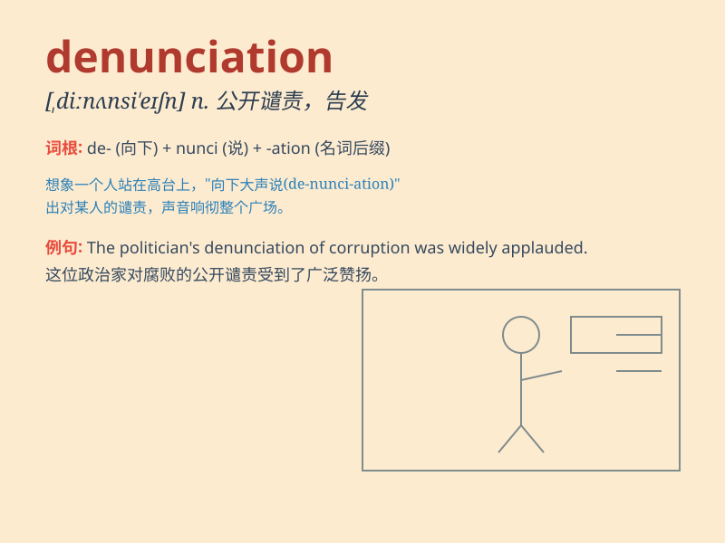

## denunciation

**英音:** _[dɪ,nʌnsɪ\'eɪʃ(ə)n]_ **美音:**
_[dɪ,nʌnsɪ\'eʃən]_

**译义:** *n.谴责,告发*

### 短语

+ **public denunciation:** _公开谴责_

+ **loud denunciation:** _大声谴责_

+ **vehement denunciation:** _强烈谴责_

+ **moral denunciation:** _道德谴责_

+ **angry denunciation:** _愤怒的谴责_

### 例句

#### 例句1

> **His denunciation of the corrupt practices caused a public
outcry.**

**中文翻译:** 他对腐败行为的谴责引起了公众的强烈抗议。

**单词释义:** 谴责；指责

#### 例句2

> **The politician faced denunciation from all sides for his
controversial remarks.**

**中文翻译:** 这位政治家因其有争议的言论而面临各方的指责。

**单词释义:** 公开指责；斥责

#### 例句3

> **Her denunciation of the crime was passionate and heartfelt.**

**中文翻译:** 她对这一罪行的谴责充满激情且发自内心。

**单词释义:** 痛斥；严责

### 背诵小故事

> A spy was caught and faced the denunciation of the whole country.
People shouted angrily at him for his betrayal. The word denunciation
here means the public act of condemning someone strongly.

**一名间谍被抓获，并面临全国的谴责。人们愤怒地对他大喊大叫，因为他的背叛。这里"denunciation"这个词意味着强烈谴责某人的公开行为。**

### 图义

