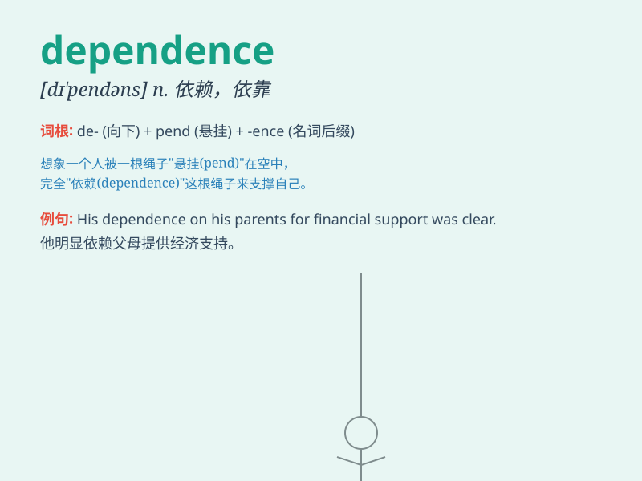

## dependence

**英音:** _[dɪ\'pend(ə)ns]_ **美音:** _[dɪ\'pɛndəns]_

**译义:** *n.依靠,依赖,信任,信赖*

### 短语

+ **dependence on:** _依靠；依赖_

+ **drug dependence:** _药物依赖_

+ **economic dependence:** _经济依赖_

+ **emotional dependence:** _情感依赖_

+ **energy dependence:** _能源依赖_

### 例句

#### 例句1

> **His dependence on drugs led to serious health problems.**

**中文翻译:** 他对毒品的依赖导致了严重的健康问题。

**单词释义:** 依赖；依靠

#### 例句2

> **The country\'s economy has a high dependence on oil exports.**

**中文翻译:** 这个国家的经济高度依赖石油出口。

**单词释义:** 依赖；依靠

#### 例句3

> **She struggled to break free from her dependence on her
parents.**

**中文翻译:** 她努力摆脱对父母的依赖。

**单词释义:** 依赖；依靠

### 背诵小故事

> A little bird was injured and couldn\'t fly. It had to depend on the
kindness of a girl for food and care. The bird\'s dependence on the girl
taught it the importance of help.

**一只小鸟受伤了不能飞。它不得不依赖一个女孩的善良来获取食物和照顾。小鸟对女孩的依赖让它懂得了帮助的重要性。**

### 图义

