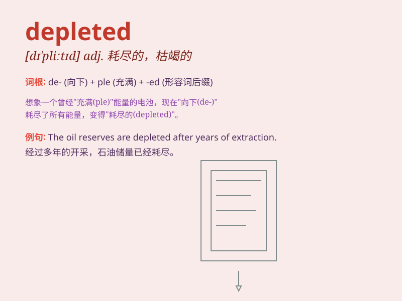

## depleted

**英音:** _[dɪ\'pliːtɪd]_ **美音:** _[dɪ\'plitɪd]_

**译义:** *adj.耗尽的; 枯竭的; 贫乏的; v.耗尽，用尽(某人或某物);
使枯竭; 使贫瘠; （逐渐）耗尽（某物）*

### 短语

+ **depleted uranium:** _贫铀_

+ **depleted resources:** _枯竭的资源_

+ **depleted stock:** _耗尽的库存_

+ **depleted energy:** _耗尽的能量_

+ **depleted funds:** _枯竭的资金_

### 例句

#### 例句1

> **The oil reserves have been depleted.**

**中文翻译:** 石油储备已经被耗尽了。

**单词释义:** 耗尽；使减少

#### 例句2

> **His energy was depleted after the long race.**

**中文翻译:** 在长跑之后，他的精力耗尽了。

**单词释义:** 使枯竭；用尽

#### 例句3

> **The soil has become depleted of nutrients.**

**中文翻译:** 土壤的养分已经变得匮乏了。

**单词释义:** 使贫乏；缺乏

### 背诵小故事

>
想象一个古老的宝藏库，里面原本堆满了金银珠宝。但贪婪的盗贼一次次前来掠夺，最终宝藏库变得空空荡荡。这个被掠夺一空的宝藏库就像被\'depleted\'（耗尽、枯竭）的资源。

**想象一个古老的宝藏库被掠夺一空的故事来辅助记忆\'depleted\'，意思是耗尽、枯竭**

### 图义

