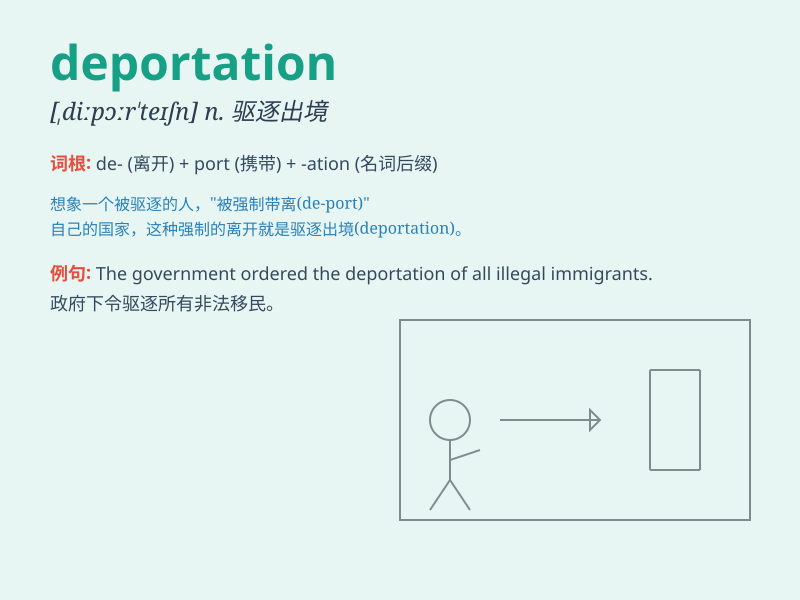

## deportation

**英音:** _[diːpɔː\'teɪʃ(ə)n]_ **美音:**
_[,dipor\'teʃən]_

**译义:** *n.移送,充军,放逐*

### 短语

+ **forced deportation:** _强制驱逐_

+ **mass deportation:** _大规模驱逐_

+ **deportation order:** _驱逐令_

+ **risk of deportation:** _被驱逐的风险_

+ **prevent deportation:** _防止驱逐_

### 例句

#### 例句1

> **The deportation of illegal immigrants has been a controversial
issue.**

**中文翻译:** 非法移民的驱逐一直是一个有争议的问题。

**单词释义:** 驱逐

#### 例句2

> **He faced deportation after his visa expired.**

**中文翻译:** 他在签证过期后面临驱逐。

**单词释义:** 驱逐

#### 例句3

> **The government\'s deportation policy has drawn criticism from
human rights groups.**

**中文翻译:** 政府的驱逐政策受到了人权组织的批评。

**单词释义:** 驱逐

### 背诵小故事

> A criminal was facing deportation. He had broken the law and was no
longer welcome in the country. The authorities made the decision of
deportation to protect the society.

**一名罪犯正面临驱逐出境。他触犯了法律，不再受这个国家欢迎。当局做出驱逐出境的决定以保护社会。**

### 图义

