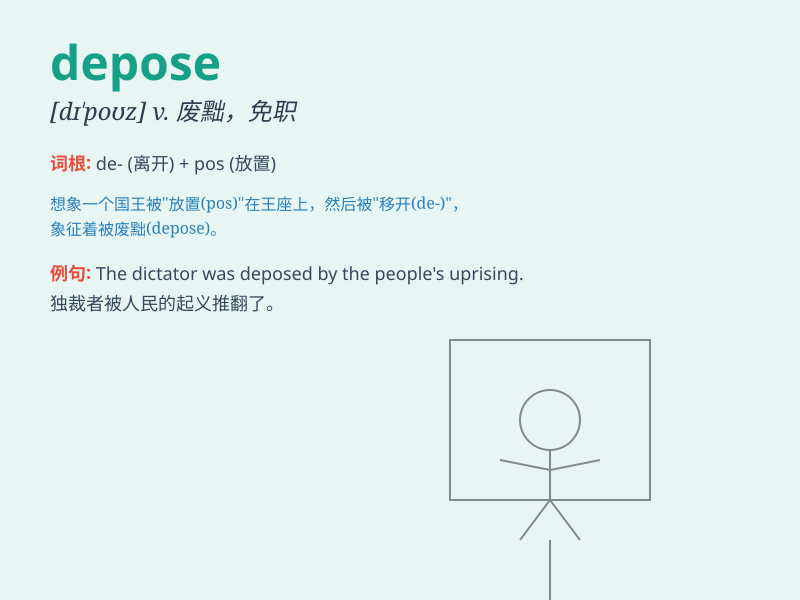

## depose

**英音:** _[dɪ\'pəʊz]_ **美音:** _[dɪ\'poz]_

**译义:** *vt.免职,废(王位),作证vi.宣誓作证*

### 短语

+ **depose from office:** _免职；罢黜_

+ **depose a witness:** _对证人进行宣誓作证_

+ **depose by force:** _武力废黜_

+ **depose under oath:** _经宣誓后作证_

+ **depose to something:** _证明某事_

### 例句

#### 例句1

> **The king was deposed by a military coup.**

**中文翻译:** 国王被军事政变废黜。

**单词释义:** 废黜；罢免

#### 例句2

> **Witnesses were called to depose in the court case.**

**中文翻译:** 证人被传唤在法庭案件中作证。

**单词释义:** （在法庭上）宣誓作证

#### 例句3

> **The rebel forces aimed to depose the current leader.**

**中文翻译:** 叛军企图推翻现任领导人。

**单词释义:** 推翻；打倒

### 背诵小故事

> A king was depose d by his subjects. They were tired of his bad
governance. So, they removed him from the throne. Remember, \'depose\'
means to remove from a position of power.

**一位国王被他的臣民废黜了。他们厌倦了他的糟糕统治。所以，他们把他从王位上赶了下来。记住，\'depose\'意思是废黜，罢免。**

### 图义

