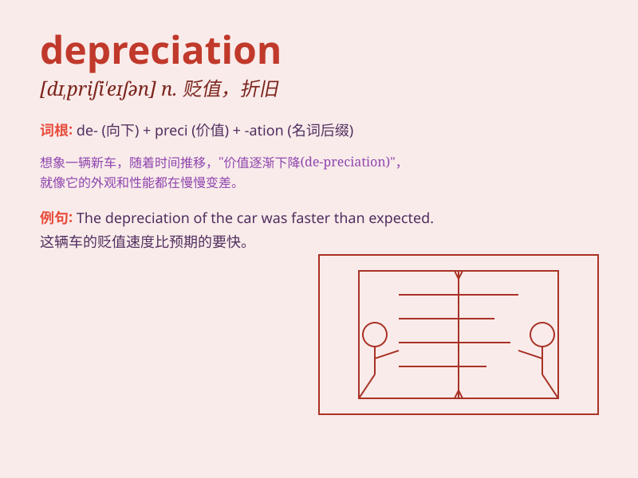

## depreciation

**英音:** _[dɪ,priːʃɪ\'eɪʃ(ə)n; -sɪ\'eɪ-]_ **美音:**
_[dɪ,priʃɪ\'eʃən]_

**译义:** *n.贬值,减价,跌落,折旧,轻视*

### 短语

+ **accelerated depreciation:** _加速折旧_

+ **depreciation expense:** _折旧费用_

+ **straight-line depreciation:** _直线折旧法_

+ **accumulated depreciation:** _累计折旧_

+ **depreciation rate:** _折旧率_

### 例句

#### 例句1

> **The depreciation of the currency led to higher import costs.**

**中文翻译:** 货币的贬值导致了更高的进口成本。

**单词释义:** 贬值

#### 例句2

> **The company accounts for depreciation of its assets every
year.**

**中文翻译:** 公司每年都会对其资产的折旧进行核算。

**单词释义:** 折旧

#### 例句3

> **His car suffered rapid depreciation in value after the
accident.**

**中文翻译:** 他的车在事故后价值迅速贬值。

**单词释义:** 贬值

### 背诵小故事

> A company was worried about the depreciation of its machines. As time
passed, the machines became less valuable and cost the company money. It
was like a race against time to make profits before the big
depreciation.

**一家公司担心其机器的折旧。随着时间的推移，机器变得不那么值钱了，这让公司损失了钱。这就像是在大折旧之前与时间赛跑以赚取利润。**

### 图义

