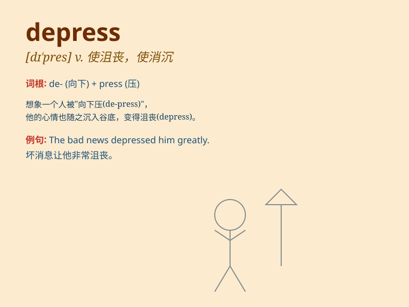

## depress

**英音:** _[dɪ\'pres]_ **美音:** _[dɪ\'prɛs]_

**译义:** *vt.使沮丧,使消沉,压下,压低,使不活泼,使萧条v.压下*

### 短语

+ **depress prices:** _压低价格_

+ **depress the economy:** _使经济萧条_

+ **depress sb\'s spirits:** _使某人情绪低落_

+ **depress the market:** _使市场萧条_

+ **depress sales:** _降低销售额_

### 例句

#### 例句1

> **The bad news depressed him deeply.**

**中文翻译:** 这个坏消息让他深感沮丧。

**单词释义:** 使沮丧，使消沉

#### 例句2

> **The economy is in a state that depresses business investment.**

**中文翻译:** 经济处于抑制商业投资的状态。

**单词释义:** 抑制，降低

#### 例句3

> **The rainy weather always depresses my mood.**

**中文翻译:** 阴雨天气总是让我的心情低落。

**单词释义:** 使低落

### 背诵小故事

> A poor artist was always rejected by galleries. This made him feel
very sad and down. The constant rejections depressed him. He lost all
hope and couldn\'t create anymore.

**一位贫穷的艺术家总是被画廊拒绝。这让他感到非常悲伤和低落。不断的拒绝使他沮丧。他失去了所有希望，再也无法创作了。**

### 图义

