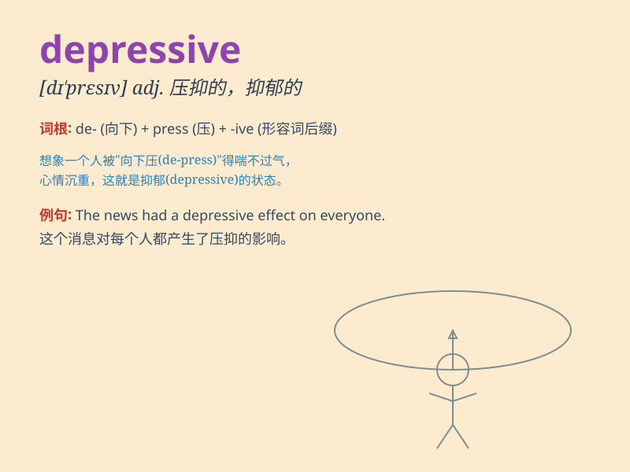

## depressive

**英音:** _[dɪ\'presɪv]_ **美音:** _[dɪ\'prɛsɪv]_

**译义:** *adj.郁闷的*

### 短语

+ **depressive disorder:** _抑郁症_

+ **depressive episode:** _抑郁发作_

+ **depressive symptoms:** _抑郁症状_

+ **chronic depressive state:** _慢性抑郁状态_

+ **endogenous depressive:** _内源性抑郁症患者_

### 例句

#### 例句1

> **She has been in a depressive state since the failure of her
business.**

**中文翻译:** 自从她的生意失败以来，她一直处于抑郁状态。

**单词释义:** 抑郁的

#### 例句2

> **The weather was so gloomy that it gave me a depressive
feeling.**

**中文翻译:** 天气如此阴沉，给我一种压抑的感觉。

**单词释义:** 压抑的

#### 例句3

> **His depressive mood affected his performance at work.**

**中文翻译:** 他的抑郁情绪影响了他的工作表现。

**单词释义:** 抑郁的

### 背诵小故事

> A young artist felt very depressive. His paintings were not
appreciated. But one day, a wise man told him to keep going. Finally, he
became famous. Remember, depressive times don\'t last.

**一位年轻的艺术家感到非常沮丧。他的画作不被赏识。但有一天，一位智者告诉他要坚持下去。最后，他出名了。记住，沮丧的时光不会长久。**

### 图义

