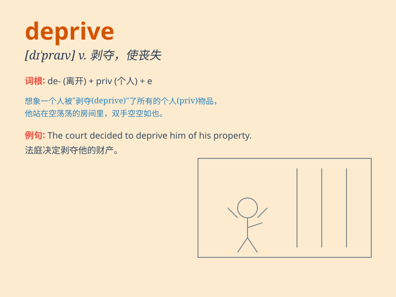

## deprive

**英音:** _[dɪ\'praɪv]_ **美音:** _[dɪ\'praɪv]_

**译义:** *vt.剥夺,使丧失*

### 短语

+ **deprive of:** _剥夺；使丧失_

+ **be deprived of:** _被剥夺；失去_

+ **deprive sb of sth:** _剥夺某人某物_

+ **deprive oneself of:** _自行剥夺；克制自己不做某事_

+ **deprive something of its value:** _使某物失去价值_

### 例句

#### 例句1

> **The criminal was deprived of his political rights.**

**中文翻译:** 这个罪犯被剥夺了政治权利。

**单词释义:** 剥夺

#### 例句2

> **Illness deprived her of the chance to go to college.**

**中文翻译:** 疾病使她失去了上大学的机会。

**单词释义:** 使失去

#### 例句3

> **They were deprived of a normal childhood by the war.**

**中文翻译:** 战争剥夺了他们正常的童年。

**单词释义:** 剥夺

### 背诵小故事

> 想象一个小偷，他总是偷偷潜入人们的家中，deprive
他们的贵重物品，让人们失去了原本拥有的财富和快乐。这个小偷的行为就是
depriving 别人。

**想象一个小偷总是偷偷潜入人们家中，剥夺他们的贵重物品，让人们失去原本拥有的财富和快乐。这个小偷的行为就是剥夺别人。**

### 图义

