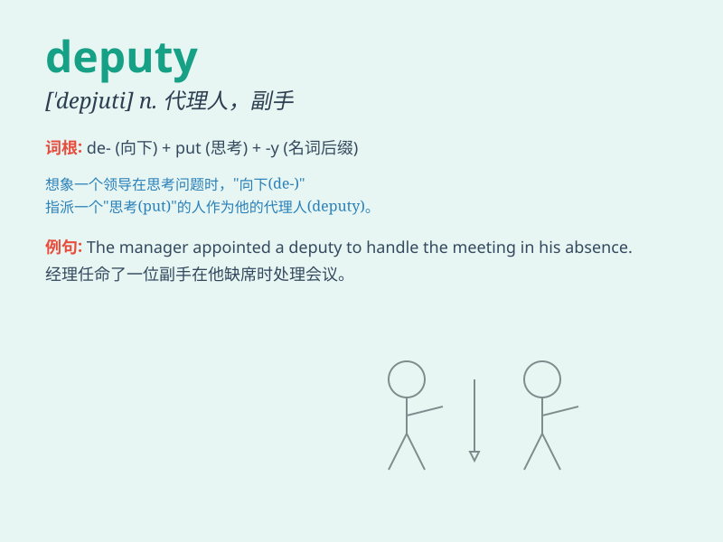

## deputy

**英音:** _[\'depjʊtɪ]_ **美音:** _[\'dɛpjuti]_

**译义:** *n.代理人,代表*

### 短语

+ **deputy director:** _副主任；副主管_

+ **deputy mayor:** _副市长_

+ **deputy head:** _副主管；副手_

+ **deputy sheriff:** _副警长_

+ **deputy chairperson:** _副主席_

### 例句

#### 例句1

> **The deputy mayor attended the meeting in place of the mayor.**

**中文翻译:** 副市长代替市长出席了会议。

**单词释义:** 副职；副手

#### 例句2

> **He was appointed as the deputy director of the company.**

**中文翻译:** 他被任命为公司的副主任。

**单词释义:** 副职；副手

#### 例句3

> **The deputy sheriff was responsible for maintaining law and order
in the county.**

**中文翻译:** 副警长负责维护该县的治安。

**单词释义:** 副职；副手

### 背诵小故事

>
想象在一个繁忙的警局，局长不在时，一位勇敢的警察小明挺身而出，承担起局长的职责。小明就是
deputy，即副职、副手。他出色地完成了任务，证明了自己的能力。

**想象在一个繁忙的警局中，局长不在时，一位叫小明的警察作为副职挺身而出，承担局长职责，从而记住
deputy 有副职、副手的意思。**

### 图义

