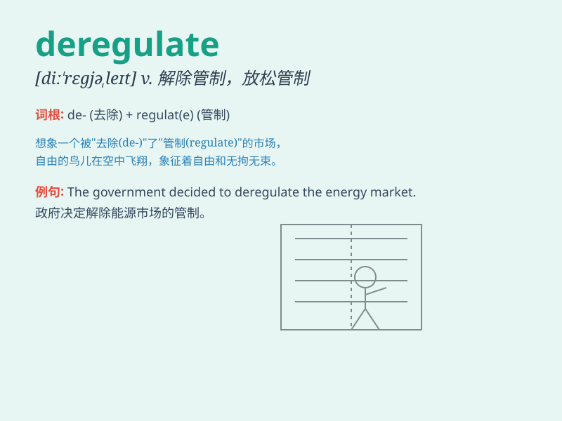

## deregulate

**英音:** _[diː\'regjʊleɪt]_ **美音:** _[,di\'rɛɡjulet]_

**译义:** *v.解除管制*

### 短语

+ **deregulate markets:** _放松对市场的管制_

+ **deregulate industry:** _解除对工业的管制_

+ **deregulate finance:** _放松金融管制_

+ **deregulate trade:** _解除贸易管制_

+ **deregulate economy:** _放松经济管制_

### 例句

#### 例句1

> **The government plans to deregulate the telecommunications
industry to promote competition.**

**中文翻译:** 政府计划放松对电信业的管制以促进竞争。

**单词释义:** 解除对\...的管制

#### 例句2

> **We should deregulate the market to allow for more innovation.**

**中文翻译:** 我们应该放松对市场的管制以允许更多创新。

**单词释义:** 放宽对\...的限制

#### 例句3

> **The new policy aims to deregulate the financial sector and
attract more investment.**

**中文翻译:** 新政策旨在解除对金融部门的管制并吸引更多投资。

**单词释义:** 撤销对\...的规定

### 背诵小故事

> Imagine a city where rules for businesses were very strict. But one
day, the mayor decided to deregulate. This means he removed many of
those strict rules to give businesses more freedom and flexibility.

**想象一个城市，企业规则非常严格。但有一天，市长决定放松管制。这意味着他取消了许多严格的规则，给企业更多的自由和灵活性。**

### 图义

