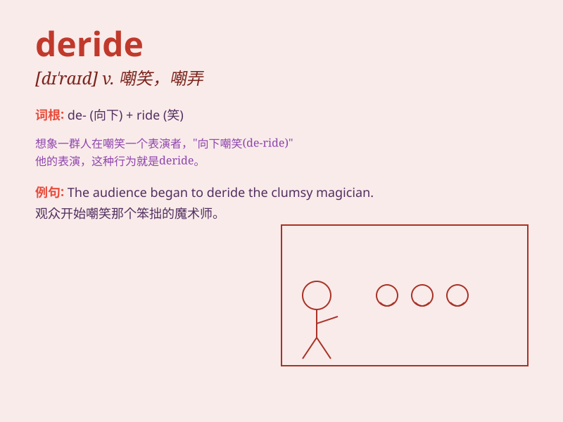

## deride

**英音:** _[dɪ\'raɪd]_ **美音:** _[dɪ\'raɪd]_

**译义:** *vt.嘲弄,嘲笑*

### 短语

+ **deride as:** _把\...嘲笑为_

+ **deride openly:** _公开嘲笑_

+ **deride constantly:** _不断嘲笑_

+ **deride harshly:** _严厉嘲笑_

+ **deride mockingly:** _嘲弄地嘲笑_

### 例句

#### 例句1

> **They derided his efforts as a waste of time.**

**中文翻译:** 他们嘲笑他的努力是浪费时间。

**单词释义:** 嘲笑；讥讽

#### 例句2

> **Don\'t deride others for their mistakes.**

**中文翻译:** 不要因为别人的错误而嘲笑他们。

**单词释义:** 嘲笑；贬低

#### 例句3

> **She always derides my fashion sense.**

**中文翻译:** 她总是嘲笑我的时尚品味。

**单词释义:** 嘲笑；嘲弄

### 背诵小故事

> A proud king always derided the poor villagers. One day, when he was
deriding them again, a wise man came and told him that kindness is more
powerful. The king finally understood his mistake.

**一位骄傲的国王总是嘲笑贫穷的村民。有一天，当他又在嘲笑他们时，一位智者出现并告诉他善良更有力量。国王最终明白了自己的错误。**

### 图义

