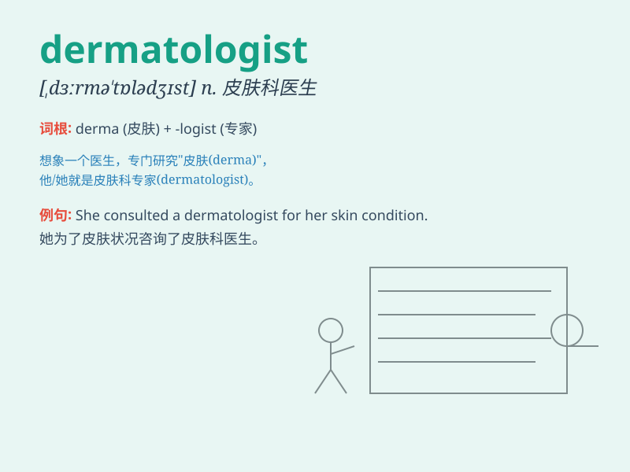

## dermatologist

**英音:** _[,dɜːmə\'tɒlədʒɪst]_ **美音:**
_[ˌdɝməˈtɑlədʒɪst]_

**译义:** *n.皮肤学者,皮肤科医生*

### 短语

+ **board-certified dermatologist:** _获得委员会认证的皮肤科医生_

+ **experienced dermatologist:** _经验丰富的皮肤科医生_

+ **renowned dermatologist:** _著名的皮肤科医生_

+ **consult a dermatologist:** _咨询皮肤科医生_

+ **visit a dermatologist:** _拜访皮肤科医生_

### 例句

#### 例句1

> **I made an appointment with a dermatologist to treat my skin
problem.**

**中文翻译:** 我预约了一位皮肤科医生来治疗我的皮肤问题。

**单词释义:** 皮肤科医生

#### 例句2

> **The dermatologist prescribed some special cream for my rash.**

**中文翻译:** 皮肤科医生为我的皮疹开了一些特殊的药膏。

**单词释义:** 皮肤科医生

#### 例句3

> **After seeing the dermatologist, my skin condition improved
significantly.**

**中文翻译:** 看了皮肤科医生后，我的皮肤状况有了显著改善。

**单词释义:** 皮肤科医生

### 背诵小故事

> A young girl had a strange skin problem. She visited a doctor called
a dermatologist. The dermatologist carefully examined her skin and
prescribed the right medicine. With the help of the dermatologist, her
skin became healthy again.

**一个年轻女孩有奇怪的皮肤问题。她去看了一位叫皮肤科医生的大夫。皮肤科医生仔细检查了她的皮肤并开了正确的药。在皮肤科医生的帮助下，她的皮肤又恢复了健康。**

### 图义

