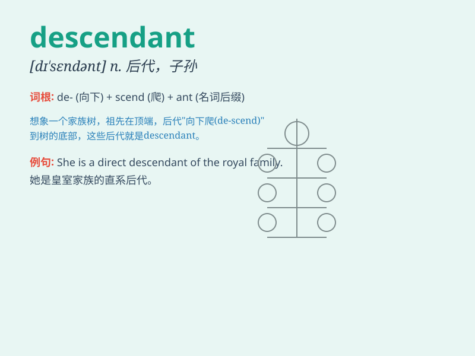

## descendant

**英音:** _[dɪ\'send(ə)nt]_ **美音:** _[dɪ\'sɛndənt]_

**译义:** *n.子孙,后裔,后代*

### 短语

+ **direct descendant:** _直系后裔_

+ **remote descendant:** _远房后裔_

+ **lineal descendant:** _直系子孙_

+ **descendant of a noble family:** _贵族家庭的后裔_

+ **descendant species:** _后裔物种_

### 例句

#### 例句1

> **He is a descendant of the famous explorer.**

**中文翻译:** 他是那位著名探险家的后裔。

**单词释义:** 后裔；子孙

#### 例句2

> **The descendants of these early settlers still live in the
area.**

**中文翻译:** 这些早期定居者的后代仍然生活在这个地区。

**单词释义:** 后代

#### 例句3

> **We are all descendants of Adam and Eve.**

**中文翻译:** 我们都是亚当和夏娃的后裔。

**单词释义:** 后裔；子孙

### 背诵小故事

>
从前有个古老的家族，家族的长辈们都希望后代（descendant）能继承优良传统。这些后代们努力成长，肩负起家族的使命，让家族的荣耀得以延续。

**从前有个古老家族，长辈希望后代继承传统，后代努力成长肩负使命让家族荣耀延续。**

### 图义

