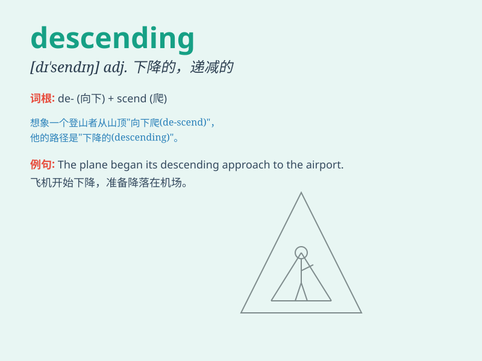

## descending

**英音:** _[dɪ\'sendɪŋ]_ **美音:** _[dɪ\'sɛndɪŋ]_

**译义:** *n.递减*

### 短语

+ **descending order:** _降序；递减次序_

+ **descending colon:** _降结肠_

+ **descending limb:** _降支_

+ **descending aorta:** _降主动脉_

+ **descending curve:** _下降曲线_

### 例句

#### 例句1

> **The airplane was in a descending flight path.**

**中文翻译:** 这架飞机处于下降的飞行路线中。

**单词释义:** 下降的

#### 例句2

> **The team is currently in a descending position in the league
standings.**

**中文翻译:** 这个团队目前在联赛排名中处于下降的位置。

**单词释义:** 下降的；下行的

#### 例句3

> **She observed the descending sun with a sense of peace.**

**中文翻译:** 她平静地看着正在西下的太阳。

**单词释义:** 西下的；下落的

### 背诵小故事

> A brave astronaut was descending from a spaceship. He wore a special
suit and held a rope. As he moved down slowly, everyone watched in
excitement. Descending means going down.

**一位勇敢的宇航员正从宇宙飞船下降。他穿着特殊的服装，抓着一根绳子。当他慢慢往下移动时，每个人都兴奋地看着。Descending
意思是下降。**

### 图义

