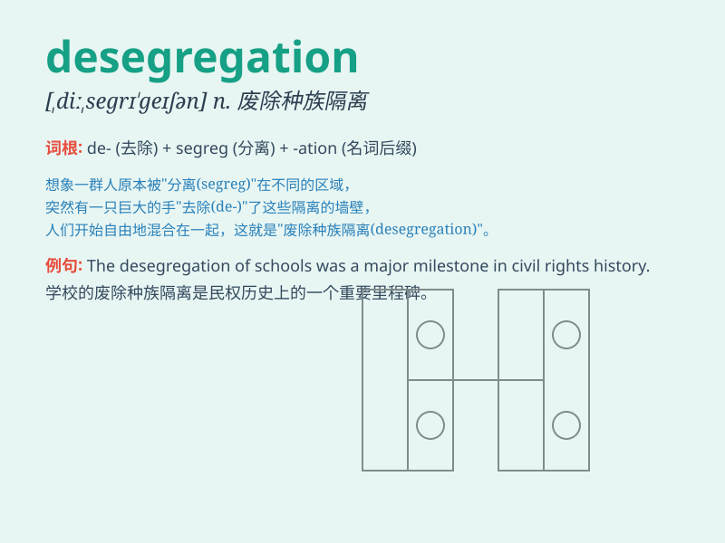

## desegregation

**英音:** _[ˌdiːˌseɡrɪ\'ɡeɪʃn]_ **美音:**
_[ˌdiːˌseɡrɪ\'ɡeɪʃn]_

**译义:** *n.废止种族歧视*

### 短语

+ **racial desegregation:** _种族隔离的废除_

+ **school desegregation:** _学校取消种族隔离_

+ **desegregation policy:** _废除种族隔离政策_

+ **desegregation movement:** _废除种族隔离运动_

+ **desegregation process:** _废除种族隔离的过程_

### 例句

#### 例句1

> **The desegregation of schools was a major social change.**

**中文翻译:** 学校的取消种族隔离是一项重大的社会变革。

**单词释义:** 取消种族隔离

#### 例句2

> **The process of desegregation in public transportation was
slow.**

**中文翻译:** 公共交通中的取消种族隔离进程缓慢。

**单词释义:** 取消种族隔离

#### 例句3

> **Desegregation brought about more equal opportunities for all.**

**中文翻译:** 取消种族隔离为所有人带来了更平等的机会。

**单词释义:** 取消种族隔离

### 背诵小故事

> In a small town, there was a big problem of segregation. But one
brave leader decided to fight for desegregation. People joined hands,
and finally, everyone could live and work together without
discrimination.

**在一个小镇上，存在着严重的种族隔离问题。但一位勇敢的领导者决定为消除种族隔离而斗争。人们携手合作，最终，每个人都能不受歧视地一起生活和工作。**

### 图义

