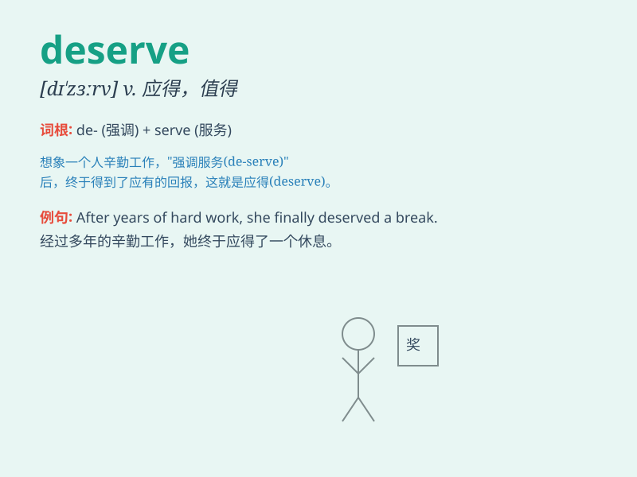

## deserve

**英音:** _[dɪ\'zɜːv]_ **美音:** _[dɪ\'zɝv]_

**译义:** *vt.应受,值得v.应受*

### 短语

+ **deserve attention:** _值得关注_

+ **deserve punishment:** _应受惩罚_

+ **deserve credit:** _值得称赞_

+ **deserve respect:** _值得尊敬_

+ **deserve consideration:** _值得考虑_

### 例句

#### 例句1

> **You deserve a promotion for your hard work.**

**中文翻译:** 由于你的努力工作，你应该得到晋升。

**单词释义:** 应得，应受

#### 例句2

> **He doesn\'t deserve your forgiveness after what he did.**

**中文翻译:** 在他做了那些事之后，他不配得到你的原谅。

**单词释义:** 应得，值得

#### 例句3

> **This project deserves more attention and resources.**

**中文翻译:** 这个项目应该得到更多的关注和资源。

**单词释义:** 应得，值得

### 背诵小故事

> A hardworking student spent countless hours studying. His efforts
were noticed by the teacher and he deserved the highest grade. It means
he was worthy of the recognition because of his hard work.

**一个勤奋的学生花费了无数个小时学习。他的努力被老师注意到了，他理应得到最高分。这意味着由于他的努力工作，他值得这样的认可。**

### 图义

