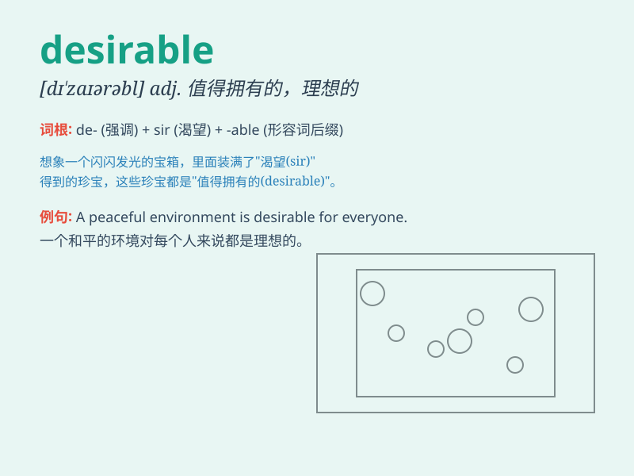

## desirable

**英音:** _[dɪ\'zaɪərəb(ə)l]_ **美音:** _[dɪ\'zaɪərəbl]_

**译义:** *adj.值得要的,合意的,令人想要的,悦人心意的*

### 短语

+ **highly desirable:** _非常令人向往的_

+ **desirable outcome:** _理想的结果_

+ **desirable property:** _理想的财产_

+ **most desirable:** _最令人向往的_

+ **find something desirable:** _发现某物令人向往_

### 例句

#### 例句1

> **A big house in the countryside is highly desirable.**

**中文翻译:** 在乡下有一所大房子是非常令人向往的。

**单词释义:** 令人向往的

#### 例句2

> **It is not always desirable to be rich and famous.**

**中文翻译:** 富有和出名并不总是令人向往的。

**单词释义:** 令人向往的

#### 例句3

> **This new policy is considered desirable for economic growth.**

**中文翻译:** 这项新政策被认为对经济增长是有利的。

**单词释义:** 有利的；值得拥有的

### 背诵小故事

> A prince was looking for a desirable princess. He met many girls, but
none were perfect. Finally, he found a kind and beautiful girl, who was
truly desirable. They lived happily ever after.

**一位王子在寻找一位令人向往的公主。他遇到了很多女孩，但都不完美。最后，他找到了一个善良美丽，真正令人向往的女孩。他们从此幸福地生活在一起。**

### 图义

