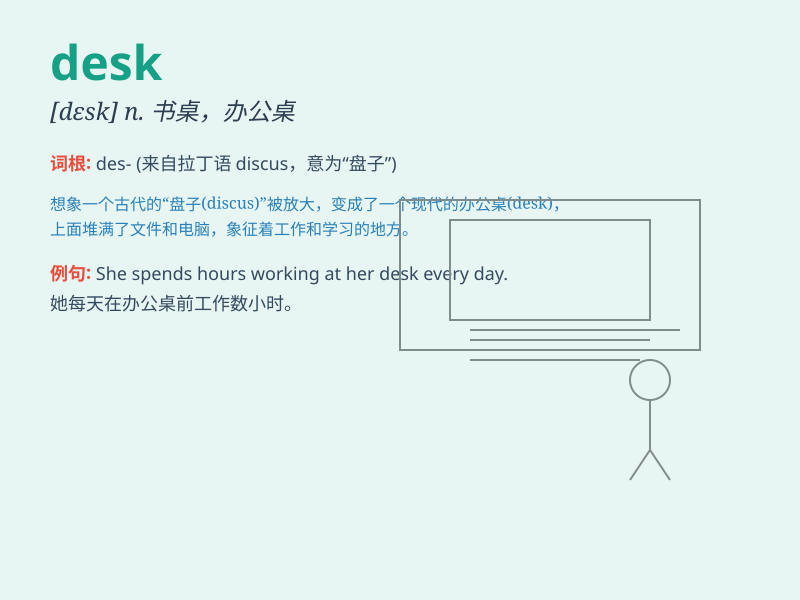

## desk

**英音:** _[desk]_ **美音:** _[dɛsk]_

**译义:** *n.书桌,办公桌*

### 短语

+ **desk lamp:** _台灯_

+ **desk calendar:** _台历_

+ **desk job:** _办公室工作_

+ **desk drawer:** _书桌抽屉_

+ **writing desk:** _写字台_

### 例句

#### 例句1

> **There is a lamp on the desk.**

**中文翻译:** 桌子上有一盏灯。

**单词释义:** 桌子

#### 例句2

> **He sat at the desk and began to write.**

**中文翻译:** 他坐在书桌旁开始写东西。

**单词释义:** 书桌

#### 例句3

> **The teacher\'s desk is in the front of the classroom.**

**中文翻译:** 老师的讲桌在教室的前面。

**单词释义:** 讲桌

### 背诵小故事

> One day, Tom was looking for his pen everywhere. Finally, he found it
on the desk. The desk was neatly arranged with books and notebooks. It
was Tom\'s favorite place to study.

**一天，汤姆到处找他的笔。最后，他在书桌上面找到了。这张书桌整齐地摆放着书和笔记本。它是汤姆最喜欢学习的地方。**

### 图义

