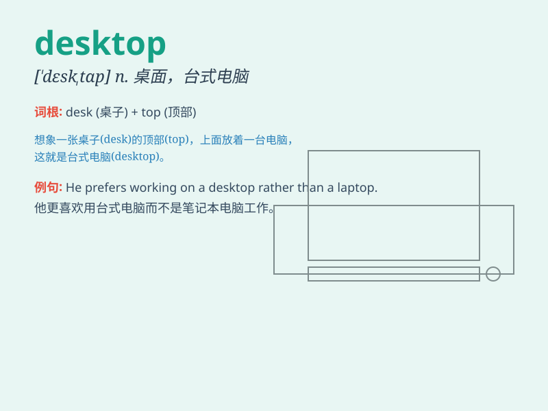

## desktop

**英音:** _[\'desktɒp]_ **美音:** _[\'dɛsk\'tɑp]_

**译义:** *n.桌面;a.台式的*

### 短语

+ **desktop computer:** _台式电脑_

+ **desktop publishing:** _桌面出版_

+ **desktop wallpaper:** _桌面壁纸_

+ **desktop icon:** _桌面图标_

+ **desktop environment:** _桌面环境_

### 例句

#### 例句1

> **I spend most of my day working at my desktop computer.**

**中文翻译:** 我一天的大部分时间都在台式电脑前工作。

**单词释义:** 台式电脑

#### 例句2

> **The desktop of this computer is very tidy.**

**中文翻译:** 这台电脑的桌面非常整洁。

**单词释义:** 电脑桌面

#### 例句3

> **He cleared the desktop before starting a new project.**

**中文翻译:** 在开始新项目之前，他清理了桌面。

**单词释义:** 桌面

### 背诵小故事

>
想象一下，你在一个神秘的房间里，有一张大大的桌子（desk），上面放满了各种神奇的东西。这张桌子就像一个舞台（top），展示着你的工作和生活。这就是桌面（desktop），一个充满可能的地方。

**想象在神秘房间里有一张像舞台一样展示工作和生活的大桌子，这就是桌面。**

### 图义

