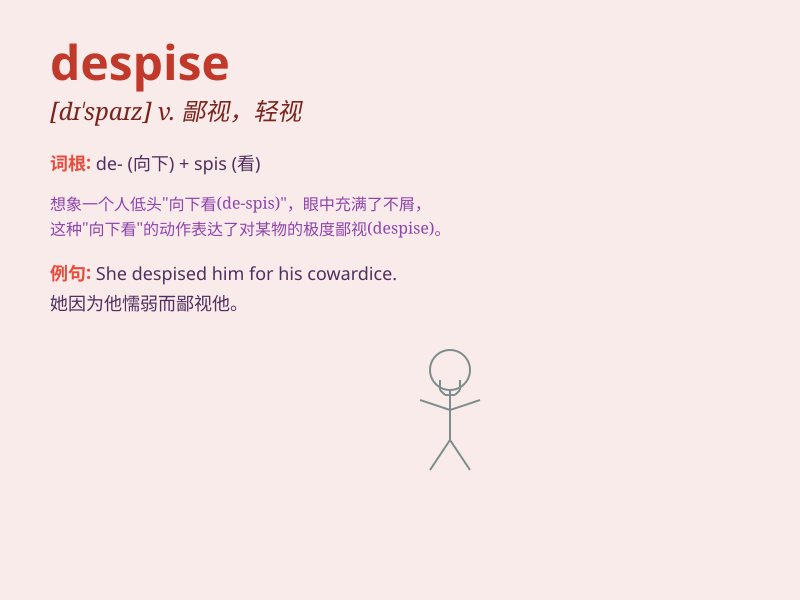

## despise

**英音:** _[dɪ\'spaɪz]_ **美音:** _[dɪ\'spaɪz]_

**译义:** *vt.轻视*

### 短语

+ **despise oneself:** _自责；自惭形秽_

+ **despise sb for sth:** _因某事而鄙视某人_

+ **utterly despise:** _极度鄙视_

+ **deeply despise:** _深深鄙视_

+ **despise heartily:** _由衷地鄙视_

### 例句

#### 例句1

> **I despise people who are cruel to animals.**

**中文翻译:** 我鄙视那些残忍对待动物的人。

**单词释义:** 鄙视

#### 例句2

> **He despises any form of dishonesty.**

**中文翻译:** 他鄙视任何形式的不诚实行为。

**单词释义:** 蔑视

#### 例句3

> **Don\'t despise her just because she made a mistake.**

**中文翻译:** 不要因为她犯了错误就鄙视她。

**单词释义:** 轻视

### 背诵小故事

> A proud king despised the poor peasants. He thought they were weak
and had no value. But in the end, it was the peasants\' unity and wisdom
that overthrew him. Remember, despise means to look down on with
contempt.

**一位骄傲的国王轻视贫穷的农民。他认为他们软弱且毫无价值。但最终，正是农民们的团结和智慧推翻了他。记住，despise
意思是轻视，看不起，带着轻蔑。**

### 图义

