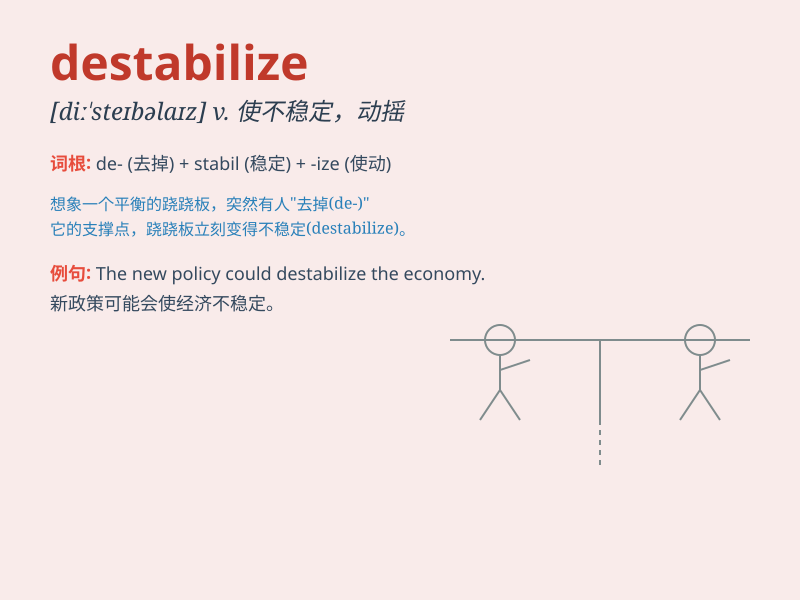

## destabilize

**英音:** _[di\'steɪbə\'laɪz]_ **美音:**
_[di\'stebə\'laɪz]_

**译义:** *vt.使动摇*

### 短语

+ **destabilize the economy:** _使经济不稳定_

+ **destabilize the region:** _使该地区不稳定_

+ **destabilize the situation:** _使局势不稳定_

+ **destabilize the balance:** _破坏平衡_

+ **destabilize the market:** _使市场不稳定_

### 例句

#### 例句1

> **The economic crisis could destabilize the country\'s political
system.**

**中文翻译:** 经济危机可能会破坏该国政治体系的稳定。

**单词释义:** 使不稳定；使动摇

#### 例句2

> **Constant changes in the market tend to destabilize small
businesses.**

**中文翻译:** 市场的不断变化往往会破坏小企业的稳定。

**单词释义:** 使失去稳定性

#### 例句3

> **The new policy has the potential to destabilize the industry.**

**中文翻译:** 新政策有可能破坏行业稳定。

**单词释义:** 破坏\...的稳定

### 背诵小故事

> A powerful storm came and destabilized the old bridge. The strong
winds and heavy rain made the structure shake and become unsafe. This
shows how something can be destabilized and lose its stability.

**一场强大的风暴袭来，使那座旧桥失去了稳定。强风和暴雨让桥梁结构摇晃，变得不安全。这表明了某物是如何被destabilize（破坏稳定）并失去稳定性的。**

### 图义

